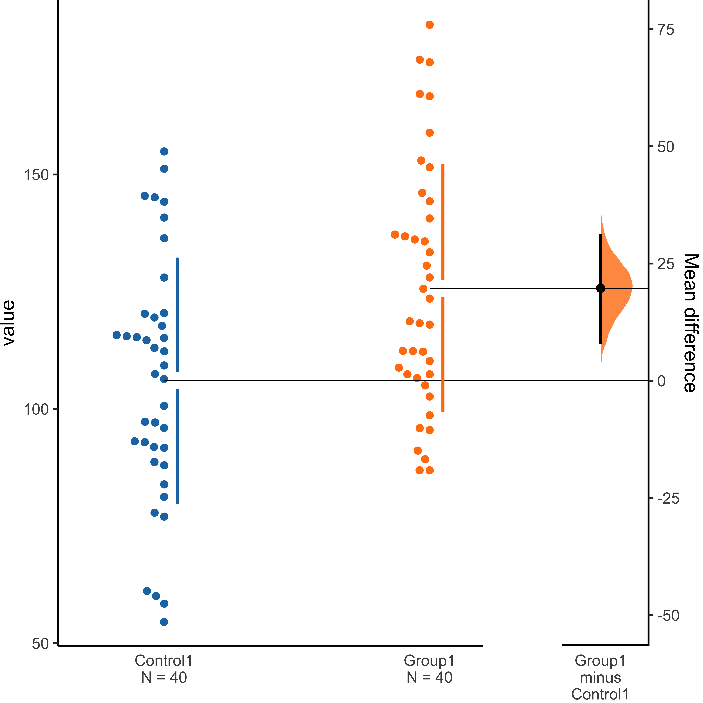
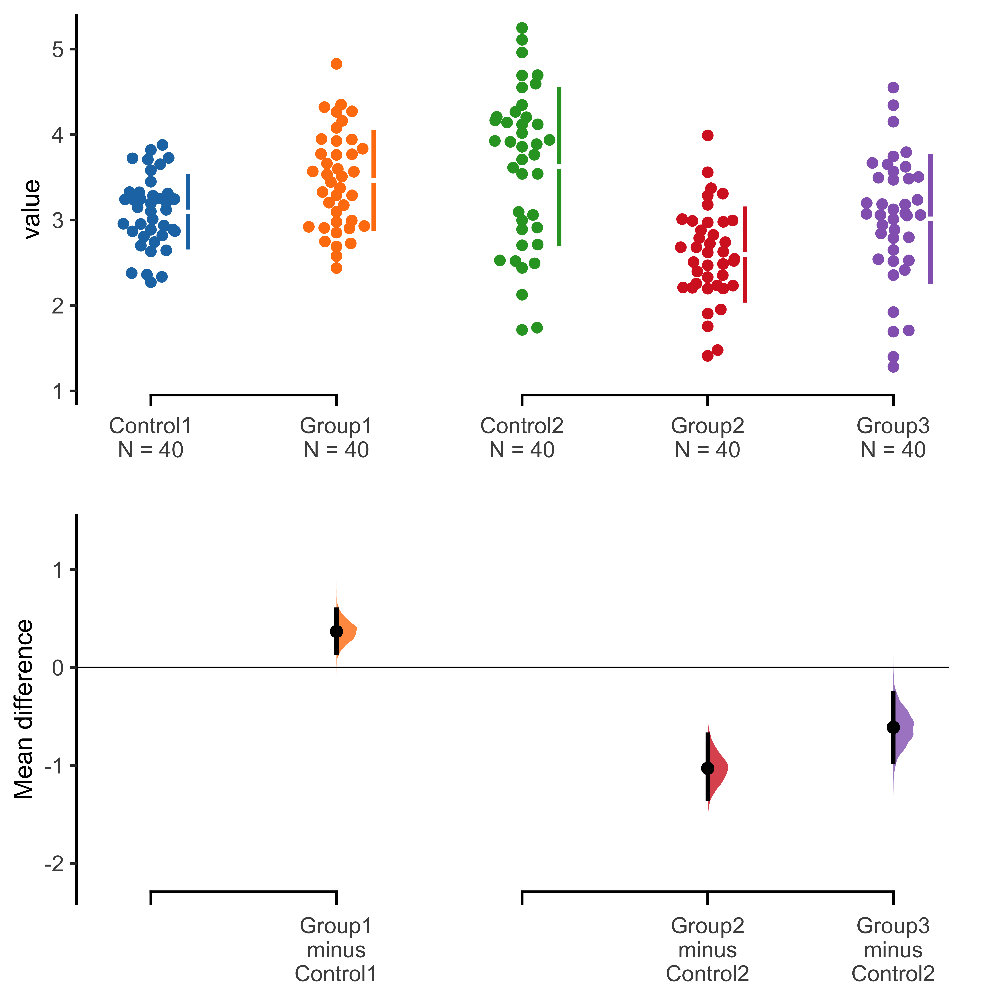
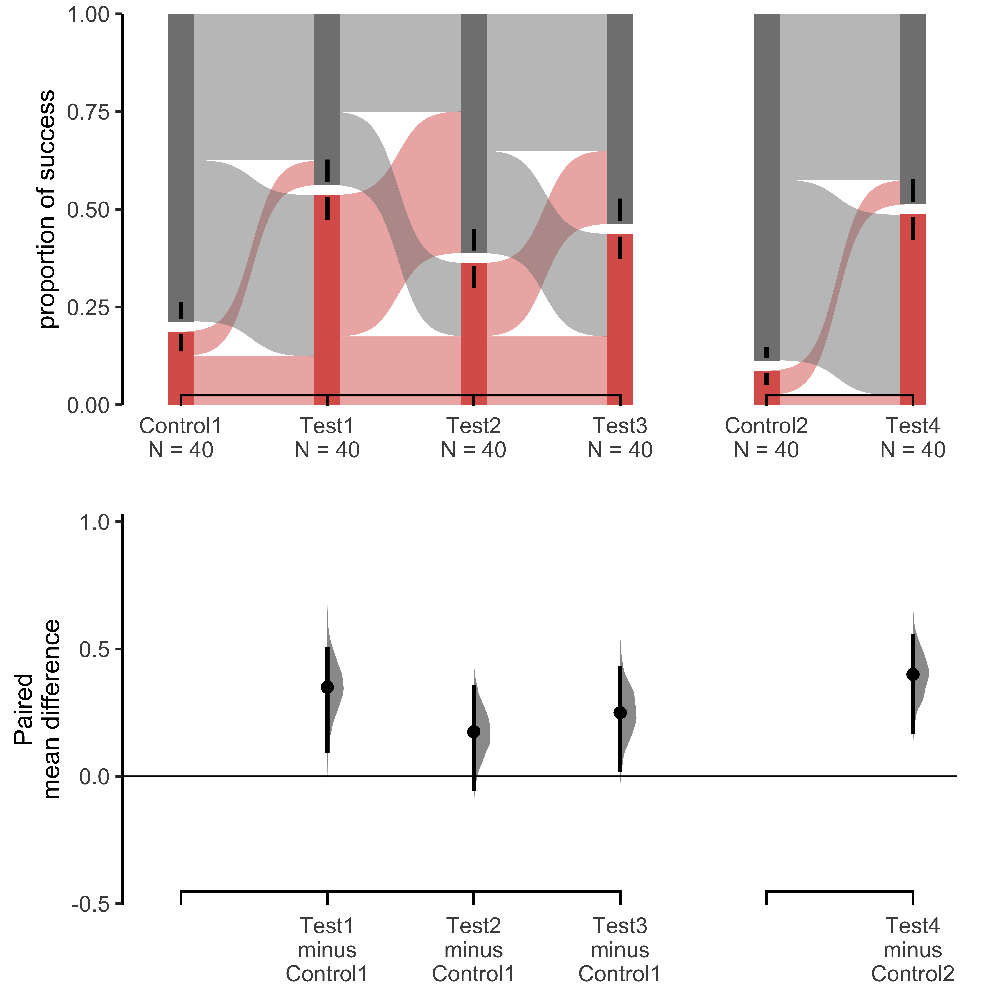
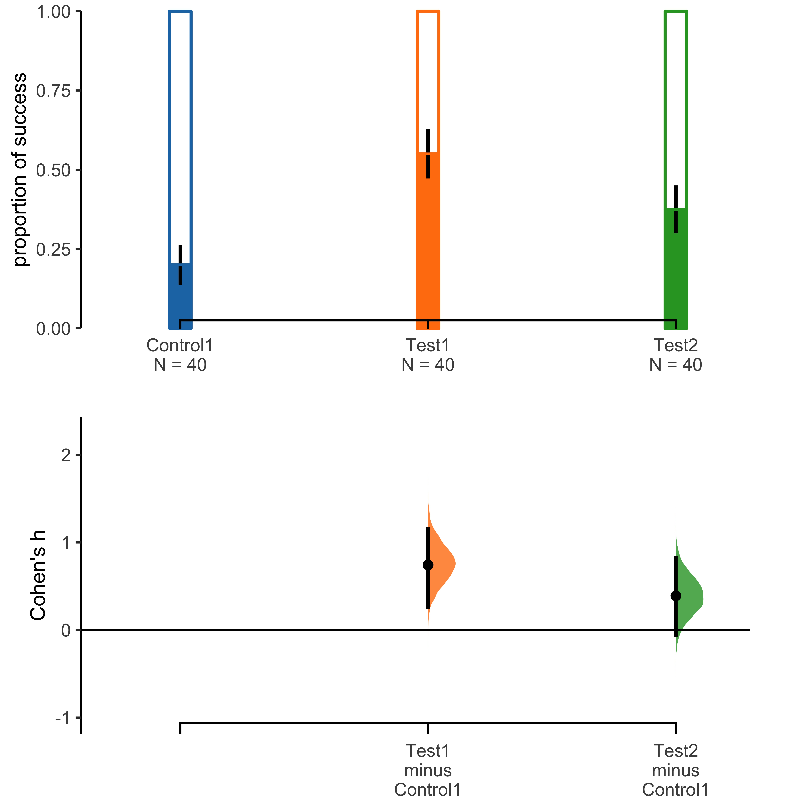

# dabestr

[](https://travis-ci.com/ACCLAB/dabestr/) [](https://cran.r-project.org/)   [](https://cran.r-project.org/package=dabestr) [](https://cran.r-project.org/package=dabestr) [](https://rdcu.be/bHhJ4) [](https://spdx.org/licenses/BSD-3-Clause-Clear.html)

## Contents

- [About](#about)
- [Requirements](#requirements)
- [Installation](#installation)
- [Usage](#usage)
- [How to cite](#how-to-cite)
- [Bugs](#bugs)
- [Contributing](#contributing)
- [dabestr in other languages](#dabestr-in-other-languages)

## About

dabestr is a package for **D**ata **A**nalysis using **B**ootstrap-Coupled **EST**imation.


[Estimation statistics](https://en.wikipedia.org/wiki/Estimation_statistics "Estimation Stats on Wikipedia") is a [simple framework](https://thenewstatistics.com/itns/ "Introduction to the New Statistics") that avoids the [pitfalls](https://www.nature.com/articles/nmeth.3288 "The fickle P value generates irreproducible results, Halsey et al 2015") of significance testing. It uses familiar statistical concepts: means, mean differences, and error bars. More importantly, it focuses on the effect size of one's experiment/intervention, as opposed to a false dichotomy engendered by *P* values.

An estimation plot has two key features.

1.  It **presents all datapoints** as a swarmplot, which orders each point to display the underlying distribution.

2.  It presents the **effect size** as a **bootstrap 95% confidence interval** on a **separate but aligned axes**.

<p float ="left">  
  
  
  
  
</p>


## Requirements

Your version of R must be 3.5.0 or higher.


## Installation

``` r
install.packages("dabestr")

# To install the latest development version on Github,
# use the line below.
devtools::install_github("ACCLAB/dabestr")
```

## Usage

``` r
library(dabestr)

# Performing unpaired (two independent groups) analysis.
unpaired_mean_diff <- dabest(iris, Species, Petal.Width,
                             idx = c("setosa", "versicolor", "virginica"),
                             paired = FALSE) %>% 
                      mean_diff()

# Display the results in a user-friendly format.
unpaired_mean_diff
#> DABEST (Data Analysis with Bootstrap Estimation in R) v0.3.0
#> ============================================================
#> 
#> Good morning!
#> The current time is 11:10 AM on Monday July 13, 2020.
#> 
#> Dataset    :  iris
#> X Variable :  Species
#> Y Variable :  Petal.Width
#> 
#> Unpaired mean difference of versicolor (n=50) minus setosa (n=50)
#>  1.08 [95CI  1.01; 1.14]
#> 
#> Unpaired mean difference of virginica (n=50) minus setosa (n=50)
#>  1.78 [95CI  1.69; 1.85]
#> 
#> 
#> 5000 bootstrap resamples.
#> All confidence intervals are bias-corrected and accelerated.

# Produce a Cumming estimation plot.
plot(unpaired_mean_diff)
```


You will find more useful code snippets in this [vignette](http://bit.ly/using-dabestr).

## How to cite

**Moving beyond P values: Everyday data analysis with estimation plots**

*Joses Ho, Tayfun Tumkaya, Sameer Aryal, Hyungwon Choi, Adam Claridge-Chang*

Nature Methods 2019, 1548-7105. [10.1038/s41592-019-0470-3](http://dx.doi.org/10.1038/s41592-019-0470-3)

[Paywalled publisher site](https://www.nature.com/articles/s41592-019-0470-3); [Free-to-view PDF](https://rdcu.be/bHhJ4)


## Bugs

Please open a [new issue](https://github.com/ACCLAB/dabestr/issues/new). Include a reproducible example (aka [reprex](https://www.tidyverse.org/help/)) so anyone can copy-paste your code and move quickly towards helping you out!


## Contributing

All contributions are welcome; please read the [Guidelines for contributing](https://github.com/ACCLAB/dabestr/blob/master/CONTRIBUTING.md) first.

We also have a [Code of Conduct](https://github.com/ACCLAB/dabestr/blob/master/CODE_OF_CONDUCT.md) to foster an inclusive and productive space.

### A wish list for new features
Currently, DABEST offers functions to handle data traditionally analyzed with Student’s paired and unpaired t-tests. It also offers plots for multiplexed versions of these, and the estimation counterpart to a 1-way analysis of variance (ANOVA), the shared-control design. While these five functions execute a large fraction of common biomedical data analyses, there remain three others: 2-way data, time-series group data, and proportional data. We aim to add these new functions to both the R and Python libraries.

● In many experiments, four groups are investigate to isolate an interaction, for example: a genotype × drug effect. Here, wild-type and mutant animals are each subjected to drug or sham treatments; the data are traditionally analysed with a 2×2 ANOVA. We have received requests by email, Twitter, and GitHub to implement an estimation counterpart to the 2-way ANOVA. To do this, we will implement ∆∆ plots, in which the difference of means (∆) of two groups is subtracted from a second two-group ∆. 

● Currently, DABEST can analyse multiple paired data in a single plot, and multiple groups with a common, shared control. However, a common design in biomedical science is to follow the same group of subjects over multiple, successive time points. An estimation plot for this would combine elements of the two other designs, and could be used in place of a repeated-measures ANOVA. 

● We have observed that proportional data are often analyzed in neuroscience and other areas of biomedical research. However, compared to other data types, the charts are frequently impoverished: often, they omit error bars, sample sizes, and even P values—let alone effect sizes. We would like DABEST to feature proportion charts, with error bars and a curve for the distribution of the proportional differences.

We encourage contributions for the above features. 


## dabestr in other languages

dabestr is also available in [Python](https://github.com/ACCLAB/DABEST-python "DABEST-Python on Github") and [Matlab](https://github.com/ACCLAB/DABEST-Matlab "DABEST-Matlab on Github").
