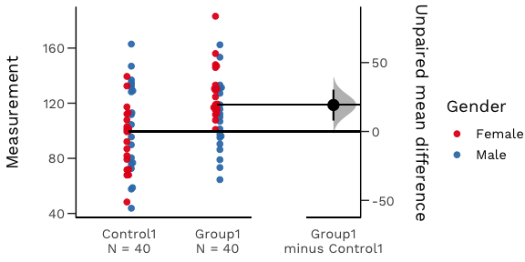
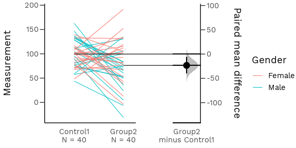
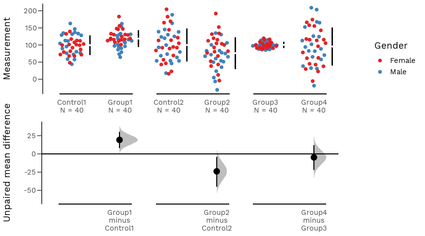
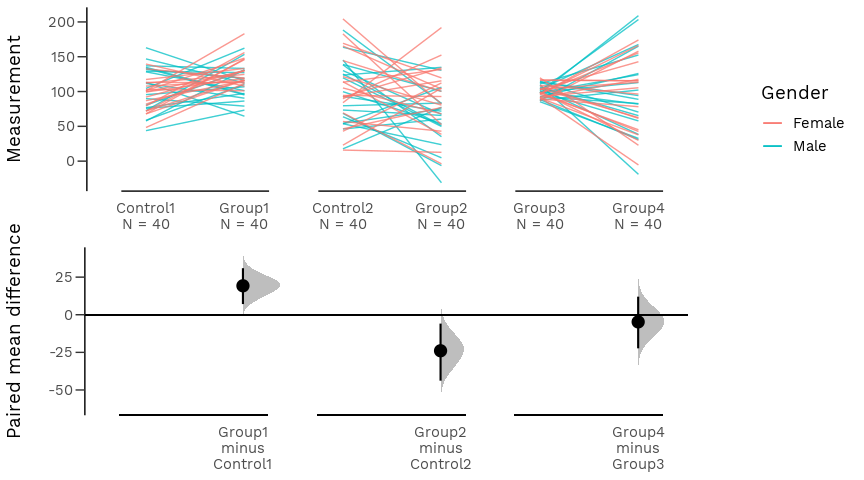
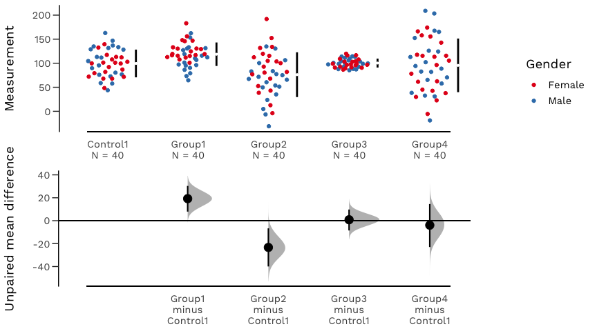
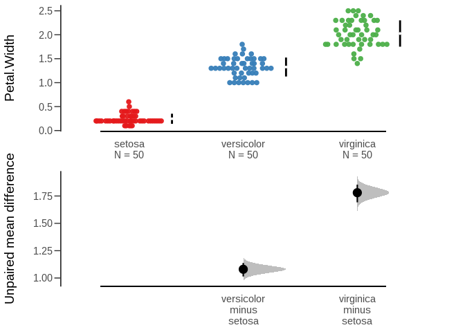

dabestr
=======

[](https://cran.r-project.org/) [](https://cran.r-project.org/package=dabestr) [](https://travis-ci.com/ACCLAB/dabestr/) [](https://opensource.org/licenses/BSD-3-Clause)

dabestr is a package for **D**ata **A**nalysis using **B**ootstrap-Coupled **EST**imation.

About
-----

[Estimation statistics](https://en.wikipedia.org/wiki/Estimation_statistics "Estimation Stats on Wikipedia") is a [simple framework](https://thenewstatistics.com/itns/ "Introduction to the New Statistics") that avoids the [pitfalls](https://www.nature.com/articles/nmeth.3288 "The fickle P value generates irreproducible results, Halsey et al 2015") of significance testing. It uses familiar statistical concepts: means, mean differences, and error bars. More importantly, it focuses on the effect size of one's experiment/intervention, as opposed to a false dichotomy engendered by *P* values.

An estimation plot has two key features.

1.  It **presents all datapoints** as a swarmplot, which orders each point to display the underlying distribution.

2.  It presents the **effect size** as a **bootstrap 95% confidence interval** on a **separate but aligned axes**.





Installation
------------

Your version of R must be 3.5.0 or higher.

``` r
install.packages("dabestr")

# To install the latest development version on Github,
# use the line below.
devtools::install_github("ACCLAB/dabestr")
```

Usage
-----

``` r
library(dabestr)

# Performing unpaired (two independent groups) analysis.
unpaired_mean_diff <- dabest(iris, Species, Petal.Width,
                             idx = c("setosa", "versicolor", "virginica"),
                             paired = FALSE)

# Display the results in a user-friendly format.
unpaired_mean_diff
#> DABEST (Data Analysis with Bootstrap Estimation) v0.1.0
#> =======================================================
#> 
#> Variable: Petal.Width 
#> 
#> Unpaired mean difference of versicolor (n=50) minus setosa (n=50)
#>  1.08 [95CI  1.01; 1.14]
#> 
#> Unpaired mean difference of virginica (n=50) minus setosa (n=50)
#>  1.78 [95CI  1.69; 1.85]
#> 
#> 
#> 5000 bootstrap resamples.
#> All confidence intervals are bias-corrected and accelerated.

# Produce a Cumming estimation plot.
plot(unpaired_mean_diff)
```



How to Cite
-----------

[**Moving beyond P values: Everyday data analysis with estimation plots**](https://doi.org/10.1101/377978 "Our BioRxiv preprint")

Joses Ho, Tayfun Tumkaya, Sameer Aryal, Hyungwon Choi, Adam Claridge-Chang

dabest In Other Languages
-------------------------

dabestr is also available in [Python](https://github.com/ACCLAB/DABEST-python "DABEST-Python on Github") and [Matlab](https://github.com/ACCLAB/DABEST-Matlab "DABEST-Matlab on Github").

Bugs
----

Please open a [new issue](https://github.com/ACCLAB/dabestr/issues/new). Include a reproducible example (aka [reprex](https://www.tidyverse.org/help/)) so anyone can copy-paste your code and move quickly towards helping you out!

Contributing
------------

All contributions are welcome. Please fork this Github repo and open a pull request.
