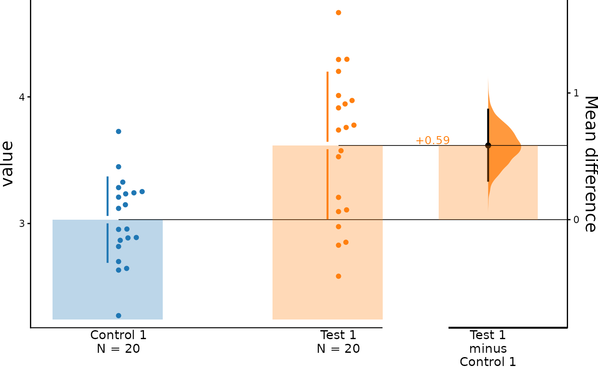
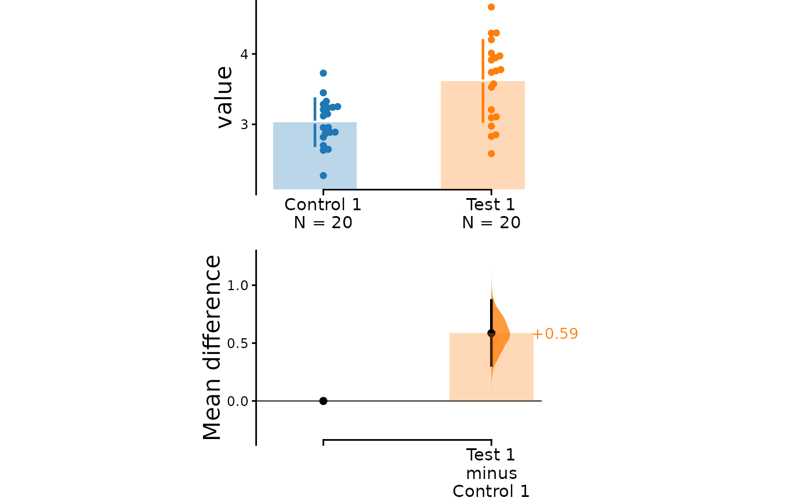
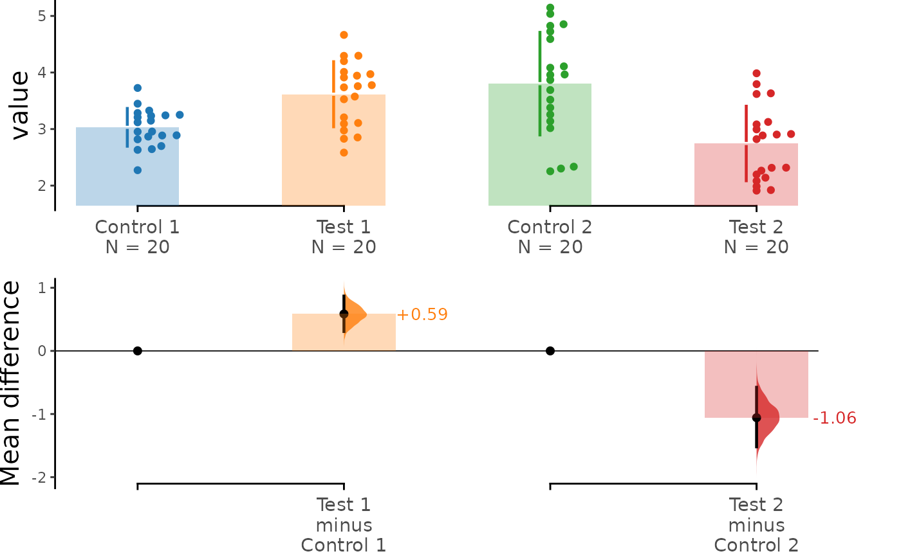
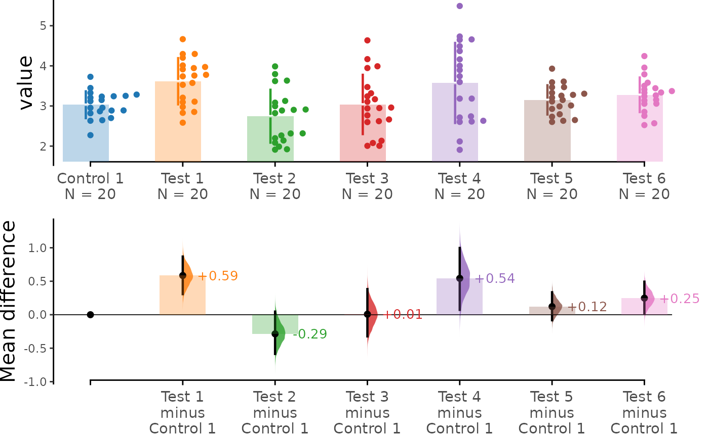
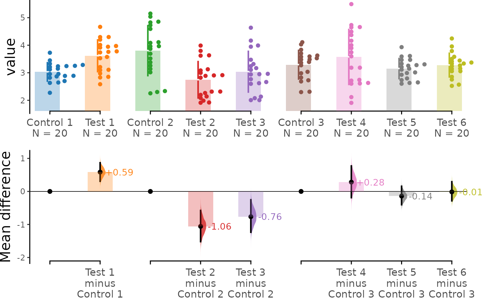

# Tutorial: Basics

This vignette documents the basic functionalities of dabestr. It
illustrates the order in which the functions are meant to be used
procedurally.

The dataset is first processed into the dabestr format using the
[`load()`](https://acclab.github.io/dabestr/reference/load.md) function.
Next, the effect sizes are calculated using the effect_size() function.
Finally, the estimation plots are generated using
[`dabest_plot()`](https://acclab.github.io/dabestr/reference/dabest_plot.md).

``` r

library(dabestr)
library(dplyr)
```

## Create dataset for demo

Here, we create a dataset to illustrate how dabest functions. In this
dataset, each column corresponds to a group of observations.

``` r

set.seed(12345) # Fix the seed so the results are replicable.
# pop_size = 10000 # Size of each population.
N <- 20

# Create samples
c1 <- rnorm(N, mean = 3, sd = 0.4)
c2 <- rnorm(N, mean = 3.5, sd = 0.75)
c3 <- rnorm(N, mean = 3.25, sd = 0.4)

t1 <- rnorm(N, mean = 3.5, sd = 0.5)
t2 <- rnorm(N, mean = 2.5, sd = 0.6)
t3 <- rnorm(N, mean = 3, sd = 0.75)
t4 <- rnorm(N, mean = 3.5, sd = 0.75)
t5 <- rnorm(N, mean = 3.25, sd = 0.4)
t6 <- rnorm(N, mean = 3.25, sd = 0.4)

# Add a `gender` column for coloring the data.
gender <- c(rep("Male", N / 2), rep("Female", N / 2))

# Add an `id` column for paired data plotting.
id <- 1:N

# Combine samples and gender into a DataFrame.
df <- tibble::tibble(
  `Control 1` = c1, `Control 2` = c2, `Control 3` = c3,
  `Test 1` = t1, `Test 2` = t2, `Test 3` = t3, `Test 4` = t4, `Test 5` = t5, `Test 6` = t6,
  Gender = gender, ID = id
)

df <- df %>%
  tidyr::gather(key = Group, value = Measurement, -ID, -Gender)
```

Note that we have 9 groups (3 *Control* samples and 6 *Test* samples).
Our dataset also has a non-numerical column indicating gender, and
another column indicating the identity of each observation.

This is known as a *long* dataset. See this
[writeup](https://simonejdemyr.com/r-tutorials/basics/wide-and-long/)
for more details.

``` r

knitr::kable(head(df))
```

| Gender |  ID | Group     | Measurement |
|:-------|----:|:----------|------------:|
| Male   |   1 | Control 1 |    3.234211 |
| Male   |   2 | Control 1 |    3.283786 |
| Male   |   3 | Control 1 |    2.956279 |
| Male   |   4 | Control 1 |    2.818601 |
| Male   |   5 | Control 1 |    3.242355 |
| Male   |   6 | Control 1 |    2.272818 |

## Step 1: Loading Data

Before generating estimation plots and deriving confidence intervals for
our effect sizes, we must first load the data and the corresponding
groups.

To achieve this, we merely provide the DataFrame to the
[`load()`](https://acclab.github.io/dabestr/reference/load.md) function,
along with ‘x’ and ‘y’ representing the columns containing the treatment
groups and measurement values, respectively. Additionally, we need to
specify the two groups you wish to compare in the `idx` argument, either
as a vector or a list.

``` r

two_groups_unpaired <- load(df,
  x = Group, y = Measurement,
  idx = c("Control 1", "Test 1")
)
```

Printing this `dabestr` object gives you a gentle greeting, as well as
the comparisons that can be computed.

``` r

print(two_groups_unpaired)
#> DABESTR v2025.3.14
#> ==================
#> 
#> Good morning!
#> The current time is 07:06 AM on Wednesday July 29, 2026.
#> 
#> ffect size(s) with 95% confidence intervals will be computed for:
#> 1. Test 1 minus Control 1
#> 
#> 5000 resamples will be used to generate the effect size bootstraps.
```

### Changing statistical parameters

You can change the width of the confidence interval that will be
produced by manipulating the `ci` argument.

``` r

two_groups_unpaired_ci90 <- load(df,
  x = Group, y = Measurement,
  idx = c("Control 1", "Test 1"), ci = 90
)
```

``` r

print(two_groups_unpaired_ci90)
#> DABESTR v2025.3.14
#> ==================
#> 
#> Good morning!
#> The current time is 07:06 AM on Wednesday July 29, 2026.
#> 
#> ffect size(s) with 90% confidence intervals will be computed for:
#> 1. Test 1 minus Control 1
#> 
#> 5000 resamples will be used to generate the effect size bootstraps.
```

## Step 2: Effect sizes

`dabestr` features a range of effect sizes:

- the mean difference
  ([`mean_diff()`](https://acclab.github.io/dabestr/reference/effect_size.md))
- the median difference
  ([`median_diff()`](https://acclab.github.io/dabestr/reference/effect_size.md))
- Cohen’s d
  ([`cohens_d()`](https://acclab.github.io/dabestr/reference/effect_size.md))
- Hedges’ g
  ([`hedges_g()`](https://acclab.github.io/dabestr/reference/effect_size.md))
- Cliff’s delta
  ([`cliffs_delta()`](https://acclab.github.io/dabestr/reference/effect_size.md))

The output of the
[`load()`](https://acclab.github.io/dabestr/reference/load.md) function,
a `dabest` object, is then passed into these
[`effect_size()`](https://acclab.github.io/dabestr/reference/effect_size.md)
functions as a parameter.

``` r

two_groups_unpaired.mean_diff <- mean_diff(two_groups_unpaired)

print(two_groups_unpaired.mean_diff)
#> DABESTR v2025.3.14
#> ==================
#> 
#> Good morning!
#> The current time is 07:06 AM on Wednesday July 29, 2026.
#> 
#> The character(0) mean difference between Test 1 and Control 1 is 0.585 [95%CI 0.307, 0.869].
#> The p-value of the two-sided permutation t-test is 0.0004, calculated for legacy purposes only.
#> 
#> 5000 bootstrap samples were taken; the confidence interval is bias-corrected and accelerated.
#> Any p-value reported is the probability of observing the effect size (or greater),
#> assuming the null hypothesis of zero difference is true.
#> For each p-value, 5000 reshuffles of the control and test labels were performed.
```

For each comparison, the type of effect size is reported (here, it’s the
“unpaired mean difference”). The confidence interval is reported as:

*\[confidenceIntervalWidth LowerBound, UpperBound\]*

This confidence interval is generated through bootstrap resampling. See
[Bootstrap Confidence
Intervals](https://acclab.github.io/DABEST-python/blog/posts/bootstraps/bootstraps.html)
for more details.

### P-values and statistical tests

Permutation P values are only provided to allow analysts to satisfy a
customary requirement of scientific journals. DABEST’s provision of P
values does not constitute an endorsement of P values or null-hypothesis
significance testing (NHST). If users need to include these in a study,
we recommend that they:

1.  avoid performing NHST, i.e. do not compare P to an alpha.
2.  never refer to the P values in the ‘Results’ text.
3.  state in their Methods section that *“No null-hypothesis
    significance testing was performed; P values are provided for legacy
    purposes only.”*

## Step 3: Producing estimation plots

To produce a **Gardner-Altman estimation plot**, simply use the
[`dabest_plot()`](https://acclab.github.io/dabestr/reference/dabest_plot.md)
function. You can read more about its genesis and design inspiration at
[Robust and Beautiful Statistical
Visualization](https://acclab.github.io/DABEST-python/blog/posts/robust-beautiful/robust-beautiful.html).

[`dabest_plot()`](https://acclab.github.io/dabestr/reference/dabest_plot.md)
requires only one compulsory parameter to run: the
`dabest_effectsize_obj` obtained from the
[`effect_size()`](https://acclab.github.io/dabestr/reference/effect_size.md)
function. This means that you can quickly create plots for various
effect sizes with ease.

``` r

dabest_plot(two_groups_unpaired.mean_diff)
```



Instead of a Gardner-Altman plot, you can produce a **Cumming estimation
plot** by setting `float_contrast = FALSE` in the
[`dabest_plot()`](https://acclab.github.io/dabestr/reference/dabest_plot.md)
function. This will plot the bootstrap effect sizes below the raw data,
and will also display the mean (gap) and ± standard deviation of each
group (vertical ends) as gapped lines. This design was inspired by
Edward Tufte’s dictum to maximise the data-ink ratio.

``` r

dabest_plot(two_groups_unpaired.mean_diff,
  float_contrast = FALSE,
  contrast_ylim = c(-0.3, 1.3)
)
```



The `dabestr` package also implements a variety of estimation plot
designs aimed at depicting common experimental designs.

The **multi-two-group estimation plot** tiles two or more Cumming plots
horizontally. To create this plot, you can pass a *nested list* to the
`idx` parameter when invoking the
[`load()`](https://acclab.github.io/dabestr/reference/load.md) function
for the first time.

As a result, the lower axes in the Cumming plot is effectively a [forest
plot](https://en.wikipedia.org/wiki/Forest_plot), commonly used in
meta-analyses to aggregate and compare data from different experiments.

``` r

multi_2group <- load(df,
  x = Group, y = Measurement,
  idx = list(
    c("Control 1", "Test 1"),
    c("Control 2", "Test 2")
  )
)
multi_2group %>%
  mean_diff() %>%
  dabest_plot()
```



The **shared control plot** displays another common experimental
paradigm, where several test samples are compared against a common
reference sample.

This type of Cumming plot is automatically generated if the vector
passed to the parameter `idx` has more than two data columns.

``` r

shared_control <- load(df,
  x = Group, y = Measurement,
  idx = c(
    "Control 1", "Test 1", "Test 2", "Test 3",
    "Test 4", "Test 5", "Test 6"
  )
)

print(shared_control)
#> DABESTR v2025.3.14
#> ==================
#> 
#> Good morning!
#> The current time is 07:06 AM on Wednesday July 29, 2026.
#> 
#> ffect size(s) with 95% confidence intervals will be computed for:
#> 1. Test 1 minus Control 1
#> 2. Test 2 minus Control 1
#> 3. Test 3 minus Control 1
#> 4. Test 4 minus Control 1
#> 5. Test 5 minus Control 1
#> 6. Test 6 minus Control 1
#> 
#> 5000 resamples will be used to generate the effect size bootstraps.
```

``` r

shared_control.mean_diff <- mean_diff(shared_control)

print(shared_control.mean_diff)
#> DABESTR v2025.3.14
#> ==================
#> 
#> Good morning!
#> The current time is 07:06 AM on Wednesday July 29, 2026.
#> 
#> The character(0) mean difference between Test 1 and Control 1 is 0.585 [95%CI 0.307, 0.869].
#> The p-value of the two-sided permutation t-test is 0.0004, calculated for legacy purposes only.
#> 
#> The character(0) mean difference between Test 2 and Control 1 is -0.286 [95%CI -0.585, 0.046].
#> The p-value of the two-sided permutation t-test is 0.0946, calculated for legacy purposes only.
#> 
#> The character(0) mean difference between Test 3 and Control 1 is 0.007 [95%CI -0.323, 0.383].
#> The p-value of the two-sided permutation t-test is 0.9673, calculated for legacy purposes only.
#> 
#> The character(0) mean difference between Test 4 and Control 1 is 0.543 [95%CI 0.073, 0.997].
#> The p-value of the two-sided permutation t-test is 0.0300, calculated for legacy purposes only.
#> 
#> The character(0) mean difference between Test 5 and Control 1 is 0.121 [95%CI -0.082, 0.335].
#> The p-value of the two-sided permutation t-test is 0.2789, calculated for legacy purposes only.
#> 
#> The character(0) mean difference between Test 6 and Control 1 is 0.248 [95%CI 0.024, 0.493].
#> The p-value of the two-sided permutation t-test is 0.0492, calculated for legacy purposes only.
#> 
#> 5000 bootstrap samples were taken; the confidence interval is bias-corrected and accelerated.
#> Any p-value reported is the probability of observing the effect size (or greater),
#> assuming the null hypothesis of zero difference is true.
#> For each p-value, 5000 reshuffles of the control and test labels were performed.
```

``` r

dabest_plot(shared_control.mean_diff)
```



The `dabestr` package empowers you to robustly perform statistical
analyses and elegantly present complex visualizations.

``` r

multi_groups <- load(df,
  x = Group, y = Measurement,
  idx = list(
    c("Control 1", "Test 1"),
    c("Control 2", "Test 2", "Test 3"),
    c("Control 3", "Test 4", "Test 5", "Test 6")
  )
)

print(multi_groups)
#> DABESTR v2025.3.14
#> ==================
#> 
#> Good morning!
#> The current time is 07:06 AM on Wednesday July 29, 2026.
#> 
#> ffect size(s) with 95% confidence intervals will be computed for:
#> 1. Test 1 minus Control 1
#> 2. Test 2 minus Control 2
#> 3. Test 3 minus Control 2
#> 4. Test 4 minus Control 3
#> 5. Test 5 minus Control 3
#> 6. Test 6 minus Control 3
#> 
#> 5000 resamples will be used to generate the effect size bootstraps.
```

``` r

multi_groups.mean_diff <- mean_diff(multi_groups)

print(multi_groups.mean_diff)
#> DABESTR v2025.3.14
#> ==================
#> 
#> Good morning!
#> The current time is 07:06 AM on Wednesday July 29, 2026.
#> 
#> The character(0) mean difference between Test 1 and Control 1 is 0.585 [95%CI 0.307, 0.869].
#> The p-value of the two-sided permutation t-test is 0.0004, calculated for legacy purposes only.
#> 
#> The character(0) mean difference between Test 2 and Control 2 is -1.058 [95%CI -1.52, -0.577].
#> The p-value of the two-sided permutation t-test is 0.0002, calculated for legacy purposes only.
#> 
#> The character(0) mean difference between Test 3 and Control 2 is -0.765 [95%CI -1.236, -0.252].
#> The p-value of the two-sided permutation t-test is 0.0059, calculated for legacy purposes only.
#> 
#> The character(0) mean difference between Test 4 and Control 3 is 0.282 [95%CI -0.188, 0.771].
#> The p-value of the two-sided permutation t-test is 0.2714, calculated for legacy purposes only.
#> 
#> The character(0) mean difference between Test 5 and Control 3 is -0.14 [95%CI -0.402, 0.156].
#> The p-value of the two-sided permutation t-test is 0.3295, calculated for legacy purposes only.
#> 
#> The character(0) mean difference between Test 6 and Control 3 is -0.014 [95%CI -0.284, 0.294].
#> The p-value of the two-sided permutation t-test is 0.9286, calculated for legacy purposes only.
#> 
#> 5000 bootstrap samples were taken; the confidence interval is bias-corrected and accelerated.
#> Any p-value reported is the probability of observing the effect size (or greater),
#> assuming the null hypothesis of zero difference is true.
#> For each p-value, 5000 reshuffles of the control and test labels were performed.
```

``` r

dabest_plot(multi_groups.mean_diff)
```



------------------------------------------------------------------------

## **NOTE: Using wide datasets**

> Currently `dabestr` does not support the use of ‘wide’ data. To
> convert datasets from ‘wide’ to ‘long’/‘tidy’, consider taking a look
> at [gather()](https://tidyr.tidyverse.org/reference/gather.html) as
> part of the [tidyr](https://tidyr.tidyverse.org) package.
