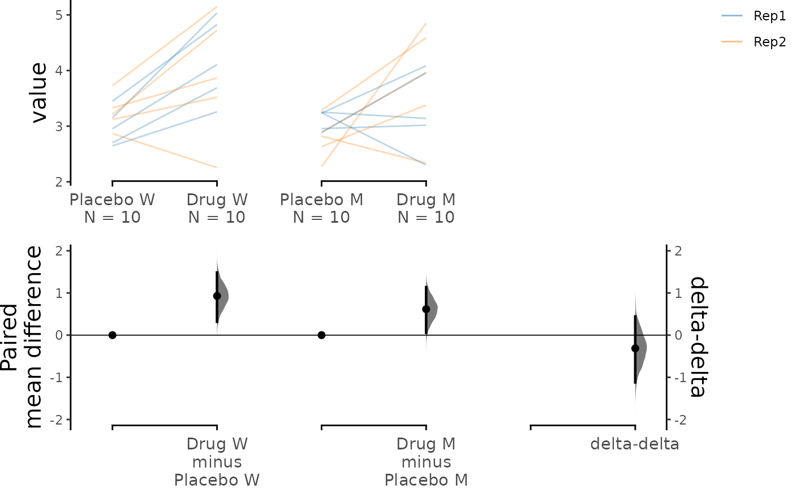
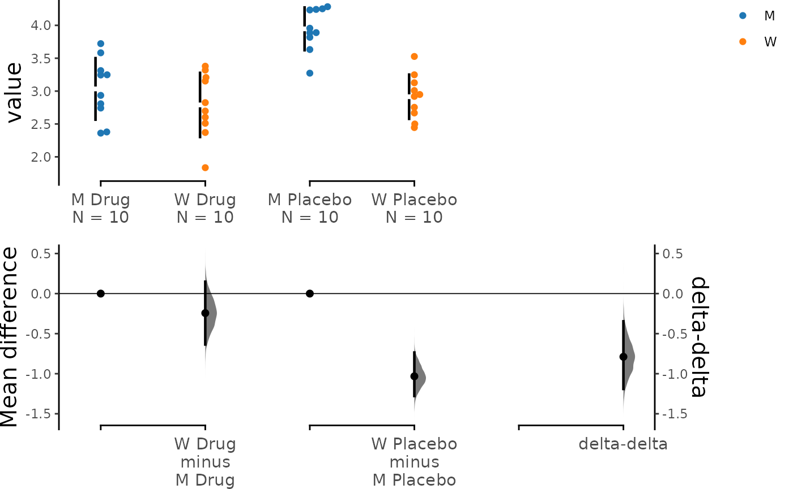
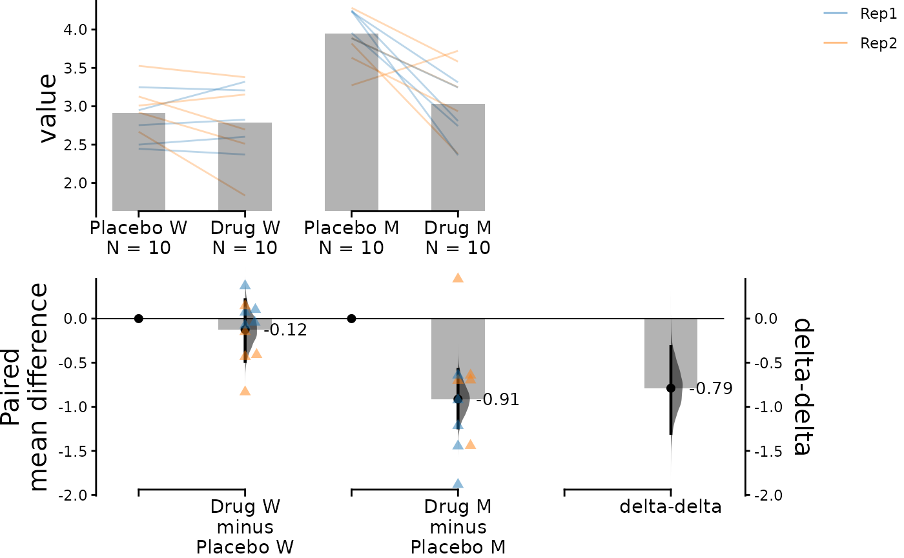
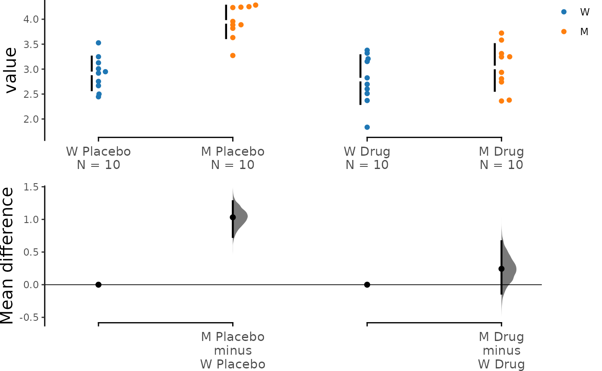

# Tutorial: Delta-Delta

This vignette documents how `dabestr` is able to compute the calculation
of delta-delta, an experimental function that allows the comparison
between two bootstrapped effect sizes computed from two independent
categorical variables.

Many experimental designs investigate the effects of two interacting
independent variables on a dependent variable. The delta-delta effect
size lets us distill the net effect of the two variables. To illustrate
this, let’s delve into the following problem…

> Consider an experiment where we test the efficacy of a drug named
> `Drug` on a disease-causing mutation `M` based on a disease metric
> `Y`. In this experiment, the greater the value `Y`is, the more severe
> the disease phenotype is. The phenotype `Y` has been shown to be
> caused by a gain of the function mutation `M`, so we expect a
> difference between the wild type (`W`) subjects and the mutant
> subjects (`M`). We want to know whether this effect is ameliorated by
> the administration of a `Drug` treatment. We also administer a placebo
> as a control. In theory, we only expect the `Drug` to have an effect
> on the `M` group, although in practice, many drugs have non-specific
> effects on healthy populations as well.

Effectively, we have 4 groups of subjects for comparison:

|         | Wild type  | Mutant     |
|:--------|:-----------|:-----------|
| Drug    | $`X_D, W`$ | $`X_D, M`$ |
| Placebo | $`X_P, W`$ | $`X_P, M`$ |

There are 2 `Treatment` conditions: the `Placebo` (control group) and
the `Drug` (test group). There are 2 `Genotypes`: `W` (wild type
population) and `M` (mutant population). Additionally, each experiment
was conducted twice (`Rep1` and `Rep2`). We will perform a few analyses
to visualise these differences in a simulated dataset.

``` r

library(dabestr)
```

## Create dataset for demo

``` r

set.seed(12345) # Fix the seed so the results are reproducible.
# pop_size = 10000 # Size of each population.
N <- 20 # The number of samples taken from each population

# Create samples
placebo <- rnorm(N / 2, mean = 4, sd = 0.4)
placebo <- c(placebo, rnorm(N / 2, mean = 2.8, sd = 0.4))
drug <- rnorm(N / 2, mean = 3, sd = 0.4)
drug <- c(drug, rnorm(N / 2, mean = 2.5, sd = 0.4))

# Add a `Genotype` column as the second variable
genotype <- c(rep("M", N / 2), rep("W", N / 2))

# Add an `id` column for paired data plotting.
id <- 1:N

# Add a `Rep` column as the first variable for the 2 replicates of experiments done
Rep <- rep(c("Rep1", "Rep2"), N / 2)

# Combine all columns into a DataFrame.
df <- tibble::tibble(
  Placebo = placebo,
  Drug = drug,
  Genotype = genotype,
  ID = id,
  Rep = Rep
)

df <- df %>%
  tidyr::gather(key = Treatment, value = Measurement, -ID, -Genotype, -Rep)
```

``` r

knitr::kable(head(df))
```

| Genotype |  ID | Rep  | Treatment | Measurement |
|:---------|----:|:-----|:----------|------------:|
| M        |   1 | Rep1 | Placebo   |    4.234211 |
| M        |   2 | Rep2 | Placebo   |    4.283786 |
| M        |   3 | Rep1 | Placebo   |    3.956279 |
| M        |   4 | Rep2 | Placebo   |    3.818601 |
| M        |   5 | Rep1 | Placebo   |    4.242355 |
| M        |   6 | Rep2 | Placebo   |    3.272818 |

## Loading Data

To make a delta-delta plot, you need to simply set `delta2 = TRUE` in
the [`load()`](https://acclab.github.io/dabestr/reference/load.md)
function. The `colour` parameter will be used to determine the colour of
dots for the scattered plots or the colour of lines for the slopegraphs.
The `experiment` parameter will be used to specify the grouping of the
data. For delta-delta plots, the `idx` parameter is optional. Here’s an
example:

## Unpaired Data

``` r

unpaired_delta2 <- load(df,
  x = Genotype, y = Measurement,
  experiment = Treatment, colour = Genotype,
  delta2 = TRUE
)
```

The above function creates the following `dabest` object:

``` r

print(unpaired_delta2)
#> DABESTR v2025.3.14
#> ==================
#> 
#> Good morning!
#> The current time is 07:06 AM on Wednesday July 29, 2026.
#> 
#> ffect size(s) with 95% confidence intervals will be computed for:
#> 1. M Placebo minus W Placebo
#> 2. M Drug minus W Drug
#> 3. Drug minus Placebo (only for mean difference)
#> 
#> 5000 resamples will be used to generate the effect size bootstraps.
```

We can quickly check out the effect sizes:

``` r

unpaired_delta2.mean_diff <- mean_diff(unpaired_delta2)

print(unpaired_delta2.mean_diff)
#> DABESTR v2025.3.14
#> ==================
#> 
#> Good morning!
#> The current time is 07:06 AM on Wednesday July 29, 2026.
#> 
#> The character(0) mean difference between M Placebo and W Placebo is 1.032 [95%CI 0.731, 1.279].
#> The p-value of the two-sided permutation t-test is 0.0000, calculated for legacy purposes only.
#> 
#> The character(0) mean difference between M Drug and W Drug is 0.244 [95%CI -0.136, 0.666].
#> The p-value of the two-sided permutation t-test is 0.2695, calculated for legacy purposes only.
#> 
#> 5000 bootstrap samples were taken; the confidence interval is bias-corrected and accelerated.
#> Any p-value reported is the probability of observing the effect size (or greater),
#> assuming the null hypothesis of zero difference is true.
#> For each p-value, 5000 reshuffles of the control and test labels were performed.
```

``` r

dabest_plot(unpaired_delta2.mean_diff)
```



The horizontal axis in the above plot represents the `Genotype`
condition, and the dot colour is also specified by `Genotype`. The left
pair of scattered plots corresponds to the `Placebo` group, while the
right pair is based on the `Drug` group. The bottom left axis contains
the two primary deltas: the `Placebo` delta and the `Drug` delta.

It is evident that when only the placebo was administered, the mutant
phenotype was around 1.23 \[95% CI: 0.948, 1.52\]. However, this
difference was reduced to approximately 0.326 \[95% CI: 0.0934, 0.584\]
when the drug was administered, indicating that the drug is effective in
ameliorating the disease phenotype. Since the `Drug` did not completely
eliminate the mutant phenotype, we need to calculate the net effect of
the drug.

Delta-delta comes in handy in this situation. We use the `Placebo` delta
as a reference for how much the mutant phenotype is supposed to be, and
we subtract the `Drug` delta from it. The bootstrapped mean differences
(delta-delta) between the `Placebo` and `Drug` group are plotted at the
bottom right with a separate y-axis from other bootstrap plots. This
effect size, at about -0.903 \[95% CI: -1.28, -0.513\], represents the
net effect size of the drug treatment. In other words, treatment with
drug A reduced the disease phenotype by 0.903.

The mean difference between mutants and wild types given the placebo
treatment is:

``` math
\Delta_1 = \bar{X}_{P,M}-\bar{X}_{P,W}
```

The mean difference between mutants and wild types given the drug
treatment is:

``` math
\Delta_2 = \bar{X}_{D,M}-\bar{X}_{D,W}
```
The net effect of the drug on mutants is:

``` math
\Delta_\Delta = \Delta_1 - \Delta_2
```
where $`\bar{X}`$ is the sample mean, $`\Delta`$ is the mean difference.

## Specifying Grouping for Comparisons

In the example above, we used the convention of “test - control’ but you
can manipulate the orders of experiment groups as well as the horizontal
axis variable by setting `experiment_label` and `x1_level`.

``` r

unpaired_delta2_specified.mean_diff <- load(df,
  x = Genotype, y = Measurement,
  experiment = Treatment, colour = Genotype,
  delta2 = TRUE,
  experiment_label = c("Drug", "Placebo"),
  x1_level = c("M", "W")
) %>%
  mean_diff()

dabest_plot(unpaired_delta2_specified.mean_diff)
```



## Paired Data

The `delta-delta` function also supports paired data, which can be
useful for visualizing the data in an alternative way. If the placebo
and drug treatment were administered to the same subjects, our data is
paired between the treatment conditions. We can specify this by using
`Treatment` as `x` and `Genotype` as `experiment`. Additionally, we can
link data from the same subject with each other by specifying `ID` as
`id_col`.

Since we have conducted two replicates of the experiments, we can colour
the slope lines according to `Rep` to differentiate between the
replicates.

Although `idx` is an optional parameter, it can still be included as an
input to adjust the order of the data as opposed to using
`experiment_label` and `x1_level`.

``` r

paired_delta2.mean_diff <- load(df,
  x = Treatment, y = Measurement,
  experiment = Genotype, colour = Rep,
  delta2 = TRUE,
  idx = list(
    c("Placebo W", "Drug W"),
    c("Placebo M", "Drug M")
  ),
  paired = "baseline", id_col = ID
) %>%
  mean_diff()

dabest_plot(paired_delta2.mean_diff,
  raw_marker_size = 0.5, raw_marker_alpha = 0.3
)
```



We see that the drug had a non-specific effect of -0.125 \[95%CI -0.486
, 0.214\] on the wild type subjects even when they were not sick, and it
had a bigger effect of -0.913 \[95%CI -1.24 , -0.577\] in the mutant
subjects. In this visualisation, we can see the delta-delta value of
-0.789 \[95%CI -1.3 , -0.317\] as the net effect of the drug accounting
for non-specific actions in healthy individuals.

The mean difference between drug and placebo treatments in wild type
subjects is:

``` math
\Delta_1 = \bar{X}_{D,M}-\bar{X}_{P,W}
```

The mean difference between drug and placebo treatments in mutant
subjects is:

``` math
\Delta_2 = \bar{X}_{D,M}-\bar{X}_{P,W}
```
The net effect of the drug on mutants is:

``` math
\Delta_\Delta = \Delta_2 - \Delta_1
```
where $`\bar{X}`$ is the sample mean, $`\Delta`$ is the mean difference.

## Connection to ANOVA

The comparison we conducted earlier is reminiscent of a two-way ANOVA.
In fact, the delta-delta is an effect size estimated for the interaction
term between `Treatment` and `Genotype`. On the other hand, main effects
of `Treatment` and `Genotype` can be determined through simpler,
univariate contrast plots.

## Omitting Delta-delta Plot

If for some reason you don’t want to display the delta-delta plot, you
can easily do so by setting `show_delta2` to FALSE:

``` r

dabest_plot(unpaired_delta2.mean_diff, show_delta2 = FALSE)
```



## Other Effect Sizes

Since the delta-delta function is only applicable to mean differences,
plots of other effect sizes will not include a delta-delta bootstrap
plot.

``` r

# cohens_d(unpaired_delta2)
```

## Statistics

You can find all the outputs of the delta - delta calculation by
assessing the column named `boot_result` of the object
`dabest_effectsize_obj`.

``` r

print(unpaired_delta2.mean_diff$boot_result)
#> # A tibble: 3 × 11
#>   control_group   test_group bootstraps nboots bca_ci_low bca_ci_high pct_ci_low
#>   <chr>           <chr>      <list>      <int>      <dbl>       <dbl>      <dbl>
#> 1 W Placebo       M Placebo  <dbl>        5000      0.731       1.28       0.748
#> 2 W Drug          M Drug     <dbl>        5000     -0.136       0.666     -0.151
#> 3 Delta2 Overall… Delta2 Ov… <dbl>        5000     -1.20       -0.337     -0.799
#> # ℹ 4 more variables: pct_ci_high <dbl>, ci <dbl>, difference <dbl>,
#> #   weight <dbl>
```

If you want to extract the permutations, permutation test’s p values,
the statistical tests and the p value results, you can access them using
the columns `permutation_test_results`, `pval_permtest`,
`pval_for_tests` and `pvalues` respectively.

For instance, the P values for permutation tests `pval_permtest`:

``` r

print(unpaired_delta2.mean_diff$permtest_pvals$pval_permtest)
#> [1] 0.0000 0.2628
```

Or the permutation calculations and results could be accessed by:

``` r

print(unpaired_delta2.mean_diff$permtest_pvals$permutation_test_results)
```

A representative *p value* for statistical tests `pval_for_tests`:

``` r

print(unpaired_delta2.mean_diff$permtest_pvals$pval_for_tests)
#> $pvalue_welch
#> [1] 1.650881e-06
#> 
#> $pvalue_welch
#> [1] 0.2694873
```

Finally here the statistical test results and `pvalues`:

``` r

print(unpaired_delta2.mean_diff$permtest_pvals$pvalues)
#> [[1]]
#> [[1]]$pvalue_welch
#> [1] 1.650881e-06
#> 
#> [[1]]$statistic_welch
#>         t 
#> -6.971633 
#> 
#> [[1]]$students_t
#> 
#>  Welch Two Sample t-test
#> 
#> data:  control and test
#> t = -6.9716, df = 17.979, p-value = 1.651e-06
#> alternative hypothesis: true difference in means is not equal to 0
#> 95 percent confidence interval:
#>  -1.3435832 -0.7212793
#> sample estimates:
#> mean of x mean of y 
#>  2.914391  3.946822 
#> 
#> 
#> [[1]]$pvalue_students_t
#> [1] 1.650881e-06
#> 
#> [[1]]$statistic_students_t
#>         t 
#> -6.971633 
#> 
#> [[1]]$pvalue_mann_whitney
#> [1] 0.0002461281
#> 
#> [[1]]$statistic_mann_whitney
#> W 
#> 1 
#> 
#> 
#> [[2]]
#> [[2]]$pvalue_welch
#> [1] 0.2694873
#> 
#> [[2]]$statistic_welch
#>         t 
#> -1.139429 
#> 
#> [[2]]$students_t
#> 
#>  Welch Two Sample t-test
#> 
#> data:  control and test
#> t = -1.1394, df = 17.968, p-value = 0.2695
#> alternative hypothesis: true difference in means is not equal to 0
#> 95 percent confidence interval:
#>  -0.6928931  0.2056392
#> sample estimates:
#> mean of x mean of y 
#>  2.789728  3.033355 
#> 
#> 
#> [[2]]$pvalue_students_t
#> [1] 0.2694873
#> 
#> [[2]]$statistic_students_t
#>         t 
#> -1.139429 
#> 
#> [[2]]$pvalue_mann_whitney
#> [1] 0.3447042
#> 
#> [[2]]$statistic_mann_whitney
#>  W 
#> 37
```
