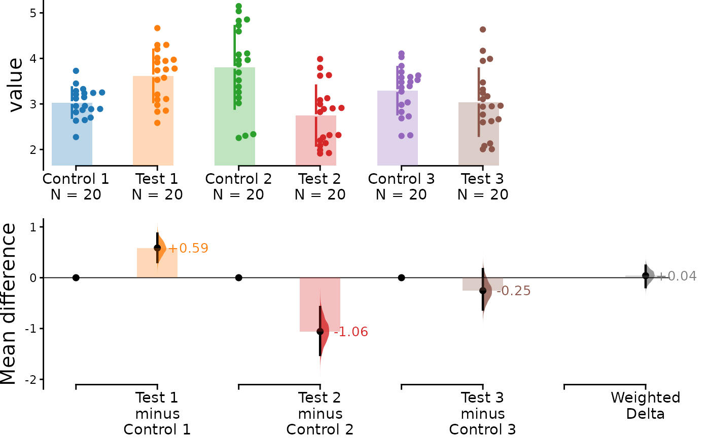
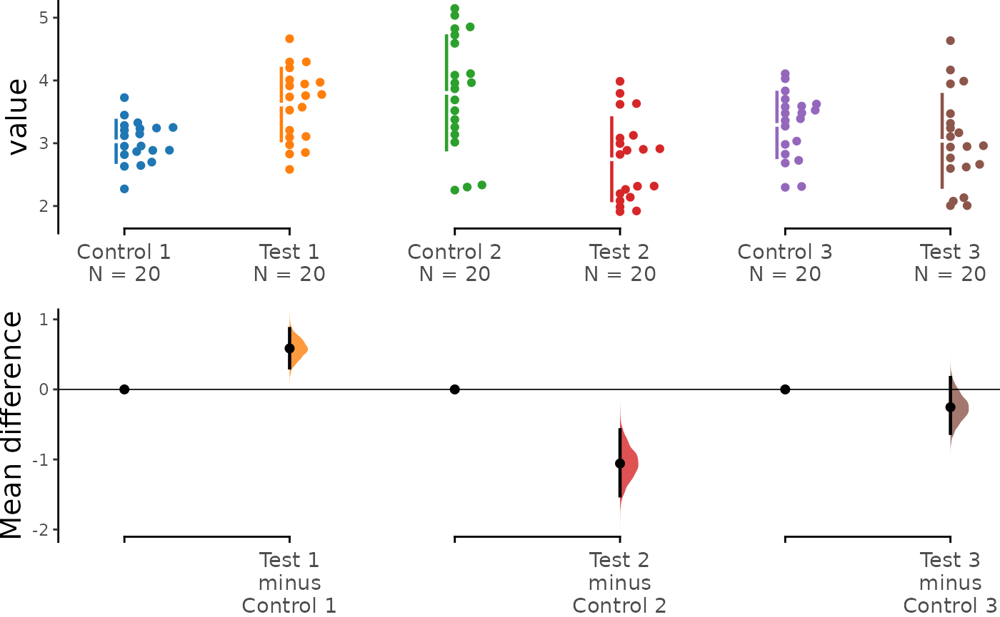
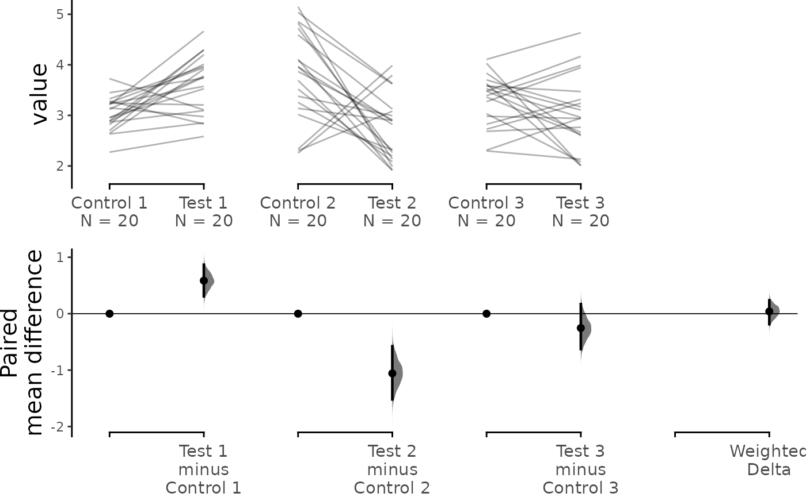

# Tutorial: Mini-Meta Delta

When scientists conduct replicates of the same experiment, the effect
size of each replicate often varies, which can make interpreting the
results more challenging. This vignette documents how `dabestr` is able
to compute the meta-analyzed weighted effect size given multiple
replicates of the same experiment. This feature can help resolve
differences between replicates and simplify interpretation.

This function uses the generic *inverse-variance* method to calculate
the effect size, as follows:

``` math
\theta_{weighted} = \frac{\sum{\hat{\theta_i}}w_i}{\sum{w_i}}
```
where:

``` math
\hat{\theta_i}=\text{Mean difference for replicate } i
```
``` math
w_i=\text{Weight for replicate } i = \frac{1}{s_i^2}
```
``` math
s_i^2=\text{Pooled variance for replicate } i = \frac{(n_{test}-1)s_{test}^2 + (n_{control}-1)s_{control}^2} {n_{test}+n_{control}-2}
```
``` math
n = \text{sample size and } s^2 = \text{variance for control/test}
```
Note that `dabestr` uses the *fixed-effects* model of meta-analysis, as
opposed to the random-effects model. This means that all variation
between the results of each replicate is assumed to be due solely to
sampling error. We recommend using this function only for replications
of the same experiment, where it can be safely assumed that each
replicate estimates the same population mean, $`\mu`$.

The `dabestr` package can only compute weighted effect size for *mean
difference only*, and not standardized measures such as *Cohen’s d*.

For more information on meta-analysis, please refer to [Chapter
10](https://training.cochrane.org/handbook/current/chapter-10) of the
*Cochrane* handbook:

``` r

library(dabestr)
library(dplyr)
```

## Create dataset for demo

``` r

set.seed(12345) # Fix the seed so the results are reproducible.
# pop_size = 10000 # Size of each population.
N <- 20 # The number of samples taken from each population

# Create samples
c1 <- rnorm(N, mean = 3, sd = 0.4)
c2 <- rnorm(N, mean = 3.5, sd = 0.75)
c3 <- rnorm(N, mean = 3.25, sd = 0.4)

t1 <- rnorm(N, mean = 3.5, sd = 0.5)
t2 <- rnorm(N, mean = 2.5, sd = 0.6)
t3 <- rnorm(N, mean = 3, sd = 0.75)

# Add a `gender` column for coloring the data.
gender <- c(rep("Male", N / 2), rep("Female", N / 2))

# Add an `id` column for paired data plotting.
id <- 1:N

# Combine samples and gender into a DataFrame.
df <- tibble::tibble(
  `Control 1` = c1, `Control 2` = c2, `Control 3` = c3,
  `Test 1` = t1, `Test 2` = t2, `Test 3` = t3,
  Gender = gender, ID = id
)

df <- df %>%
  tidyr::gather(key = Group, value = Measurement, -ID, -Gender)
```

We now have 3 Control groups and 3 Test groups, simulating 3 replicates
of the same experiment. Our dataset also includes a non-numerical column
indicating gender and another column indicating the identity of each
observation.

This is known as a ‘long’ dataset. See this
[writeup](https://simonejdemyr.com/r-tutorials/basics/wide-and-long/)
for more details.

``` r

knitr::kable(head(df))
```

| Gender |  ID | Group     | Measurement |
|:-------|----:|:----------|------------:|
| Male   |   1 | Control 1 |    3.234211 |
| Male   |   2 | Control 1 |    3.283786 |
| Male   |   3 | Control 1 |    2.956279 |
| Male   |   4 | Control 1 |    2.818601 |
| Male   |   5 | Control 1 |    3.242355 |
| Male   |   6 | Control 1 |    2.272818 |

## Loading Data

Next, we load data as we would typically do using
[`load()`](https://acclab.github.io/dabestr/reference/load.md). This
time, however, we also specify the argument `minimeta = TRUE`. As we are
loading three experiments’ worth of data, `idx` is passed as a list of
vectors, as shown below:

``` r

unpaired <- load(df,
  x = Group, y = Measurement,
  idx = list(
    c("Control 1", "Test 1"),
    c("Control 2", "Test 2"),
    c("Control 3", "Test 3")
  ),
  minimeta = TRUE
)
```

When this `dabest` object is printed, it should show that effect sizes
will be calculated for each group, as well as the weighted delta. Note
once again that the weighted delta will only be calculated for the mean
difference.

``` r

print(unpaired)
#> DABESTR v2025.3.14
#> ==================
#> 
#> Good morning!
#> The current time is 07:06 AM on Wednesday July 29, 2026.
#> 
#> ffect size(s) with 95% confidence intervals will be computed for:
#> 1. Test 1 minus Control 1
#> 2. Test 2 minus Control 2
#> 3. Test 3 minus Control 3
#> 4. weighted delta (only for mean difference)
#> 
#> 5000 resamples will be used to generate the effect size bootstraps.
```

After applying the
[`mean_diff()`](https://acclab.github.io/dabestr/reference/effect_size.md)
function to the `dabest` object, you can view the mean differences for
each group as well as the weighted delta by printing the
`dabest_effectsize_obj`.

``` r

unpaired.mean_diff <- mean_diff(unpaired)

print(unpaired.mean_diff)
#> DABESTR v2025.3.14
#> ==================
#> 
#> Good morning!
#> The current time is 07:06 AM on Wednesday July 29, 2026.
#> 
#> The character(0) mean difference between Test 1 and Control 1 is 0.585 [95%CI 0.307, 0.869].
#> The p-value of the two-sided permutation t-test is 0.0004, calculated for legacy purposes only.
#> 
#> The character(0) mean difference between Test 2 and Control 2 is -1.058 [95%CI -1.52, -0.577].
#> The p-value of the two-sided permutation t-test is 0.0002, calculated for legacy purposes only.
#> 
#> The character(0) mean difference between Test 3 and Control 3 is -0.254 [95%CI -0.626, 0.169].
#> The p-value of the two-sided permutation t-test is 0.2167, calculated for legacy purposes only.
#> 
#> 5000 bootstrap samples were taken; the confidence interval is bias-corrected and accelerated.
#> Any p-value reported is the probability of observing the effect size (or greater),
#> assuming the null hypothesis of zero difference is true.
#> For each p-value, 5000 reshuffles of the control and test labels were performed.
```

You can view the details of each experiment by accessing
`dabest_effectsize_obj$boot_results`, as shown below. This also contains
details of the weighted delta.

``` r

unpaired.mean_diff$boot_result
#> # A tibble: 4 × 11
#>   control_group   test_group bootstraps nboots bca_ci_low bca_ci_high pct_ci_low
#>   <chr>           <chr>      <list>      <int>      <dbl>       <dbl>      <dbl>
#> 1 Control 1       Test 1     <dbl>        5000      0.307       0.869     0.302 
#> 2 Control 2       Test 2     <dbl>        5000     -1.52       -0.577    -1.52  
#> 3 Control 3       Test 3     <dbl>        5000     -0.626       0.169    -0.645 
#> 4 Minimeta Overa… Minimeta … <dbl>        5000     -0.186       0.238     0.0355
#> # ℹ 4 more variables: pct_ci_high <dbl>, ci <dbl>, difference <dbl>,
#> #   weight <dbl>
```

## Unpaired Data

Simply calling the
[`dabest_plot()`](https://acclab.github.io/dabestr/reference/dabest_plot.md)
function it will generate a **Cumming estimation plot** showing the data
for each experimental replicate as well as the calculated weighted
delta.

``` r

dabest_plot(unpaired.mean_diff)
```



You can also hide the weighted delta by passing the argument
`show_mini_meta = FALSE`. In this case, the resulting graph would be
identical to a multiple two-groups plot:

``` r

dabest_plot(unpaired.mean_diff, show_mini_meta = FALSE)
```



## Paired Data

The tutorial up to this point has dealt with unpaired data. If your data
is paired data, the process for loading, plotting and accessing the data
is the same as for unpaired data, except that you need to pass the
argument `paired = "sequential"` or `paired = "baseline"` and an
appropriate `id_col` during the
[`load()`](https://acclab.github.io/dabestr/reference/load.md) step, as
follows:

``` r

paired.mean_diff <- load(df,
  x = Group, y = Measurement,
  idx = list(
    c("Control 1", "Test 1"),
    c("Control 2", "Test 2"),
    c("Control 3", "Test 3")
  ),
  paired = "baseline", id_col = ID,
  minimeta = TRUE
) %>%
  mean_diff()

dabest_plot(paired.mean_diff, raw_marker_size = 0.5, raw_marker_alpha = 0.3)
```


