# Tutorial: Proportion Plots

This vignette documents how the `dabestr` package is able to generate
proportion plots for binary data.

------------------------------------------------------------------------

**NOTE**

> It’s important to note that the code we provide only supports
> numerical proportion data, where the values are limited to 0 (failure)
> and 1 (success). This means that the code is not suitable for
> analyzing proportion data that contains non-numeric values, such as
> strings like ‘yes’ and ‘no’.

``` r

library(dabestr)
library(dplyr)
```

## Create dataset for demo

``` r

set.seed(12345) # Fix the seed so the results are reproducible.
N <- 40 # The number of samples taken from each population

# Create samples
size <- 1
c1 <- rbinom(N, size, prob = 0.2)
c2 <- rbinom(N, size, prob = 0.2)
c3 <- rbinom(N, size, prob = 0.8)

t1 <- rbinom(N, size, prob = 0.35)
t2 <- rbinom(N, size, prob = 0.2)
t3 <- rbinom(N, size, prob = 0.3)
t4 <- rbinom(N, size, prob = 0.4)
t5 <- rbinom(N, size, prob = 0.5)
t6 <- rbinom(N, size, prob = 0.6)
t7 <- c(rep(1, N))

# Add a `gender` column for coloring the data.
gender <- c(rep("Male", N / 2), rep("Female", N / 2))

# Add an `id` column for paired data plotting.
id <- 1:N

# Combine samples and gender into a DataFrame.
df <- tibble::tibble(
  `Control 1` = c1, `Control 2` = c2, `Control 3` = c3,
  `Test 1` = t1, `Test 2` = t2, `Test 3` = t3, `Test 4` = t4, `Test 5` = t5,
  `Test 6` = t6, `Test 7` = t7,
  Gender = gender, ID = id
)

df <- df %>%
  tidyr::gather(key = Group, value = Success, -ID, -Gender)
```

``` r

knitr::kable(head(df))
```

| Gender |  ID | Group     | Success |
|:-------|----:|:----------|--------:|
| Male   |   1 | Control 1 |       0 |
| Male   |   2 | Control 1 |       1 |
| Male   |   3 | Control 1 |       0 |
| Male   |   4 | Control 1 |       1 |
| Male   |   5 | Control 1 |       0 |
| Male   |   6 | Control 1 |       0 |

## Loading Data

When loading data, you need to set the parameter `proportional = TRUE`.

``` r

two_groups_unpaired <- load(df,
  x = Group, y = Success,
  idx = c("Control 1", "Test 1"),
  proportional = TRUE
)

print(two_groups_unpaired)
#> DABESTR v2025.3.14
#> ==================
#> 
#> Good morning!
#> The current time is 07:06 AM on Wednesday July 29, 2026.
#> 
#> ffect size(s) with 95% confidence intervals will be computed for:
#> 1. Test 1 minus Control 1
#> 
#> 5000 resamples will be used to generate the effect size bootstraps.
```

## Effect sizes

For proportion plot, dabest features two effect sizes:

- the mean difference
  ([`mean_diff()`](https://acclab.github.io/dabestr/reference/effect_size.md))
- Cohen’s h
  ([`cohens_h()`](https://acclab.github.io/dabestr/reference/effect_size.md))

The output of the
[`load()`](https://acclab.github.io/dabestr/reference/load.md) function,
a `dabest` object, is then passed into these
[`effect_size()`](https://acclab.github.io/dabestr/reference/effect_size.md)
functions as a parameter.

``` r

two_groups_unpaired.mean_diff <- mean_diff(two_groups_unpaired)

print(two_groups_unpaired.mean_diff)
#> DABESTR v2025.3.14
#> ==================
#> 
#> Good morning!
#> The current time is 07:06 AM on Wednesday July 29, 2026.
#> 
#> The character(0) mean difference between Test 1 and Control 1 is 0.35 [95%CI 0.15, 0.55].
#> The p-value of the two-sided permutation t-test is 0.0008, calculated for legacy purposes only.
#> 
#> 5000 bootstrap samples were taken; the confidence interval is bias-corrected and accelerated.
#> Any p-value reported is the probability of observing the effect size (or greater),
#> assuming the null hypothesis of zero difference is true.
#> For each p-value, 5000 reshuffles of the control and test labels were performed.
```

Let’s compute the *Cohen’s h* for our comparison.

``` r

two_groups_unpaired.cohens_h <- cohens_h(two_groups_unpaired)

print(two_groups_unpaired.cohens_h)
#> DABESTR v2025.3.14
#> ==================
#> 
#> Good morning!
#> The current time is 07:06 AM on Wednesday July 29, 2026.
#> 
#> The character(0) NA between Test 1 and Control 1 is 0.758 [95%CI 0.311, 1.217].
#> The p-value of the two-sided permutation t-test is 0.0008, calculated for legacy purposes only.
#> 
#> 5000 bootstrap samples were taken; the confidence interval is bias-corrected and accelerated.
#> Any p-value reported is the probability of observing the effect size (or greater),
#> assuming the null hypothesis of zero difference is true.
#> For each p-value, 5000 reshuffles of the control and test labels were performed.
```

## Generating Unpaired Proportional Plots

To produce a **Gardner-Altman estimation plot**, simply use the
[`dabest_plot()`](https://acclab.github.io/dabestr/reference/dabest_plot.md)
function.

The
[`dabest_plot()`](https://acclab.github.io/dabestr/reference/dabest_plot.md)
function only requires one compulsory parameter to run, the
`dabest_effectsize_obj` obtained from the
[`effect_size()`](https://acclab.github.io/dabestr/reference/effect_size.md)
function. Thus, you can quickly and easily create plots for different
effect sizes.

``` r

dabest_plot(two_groups_unpaired.mean_diff)
```

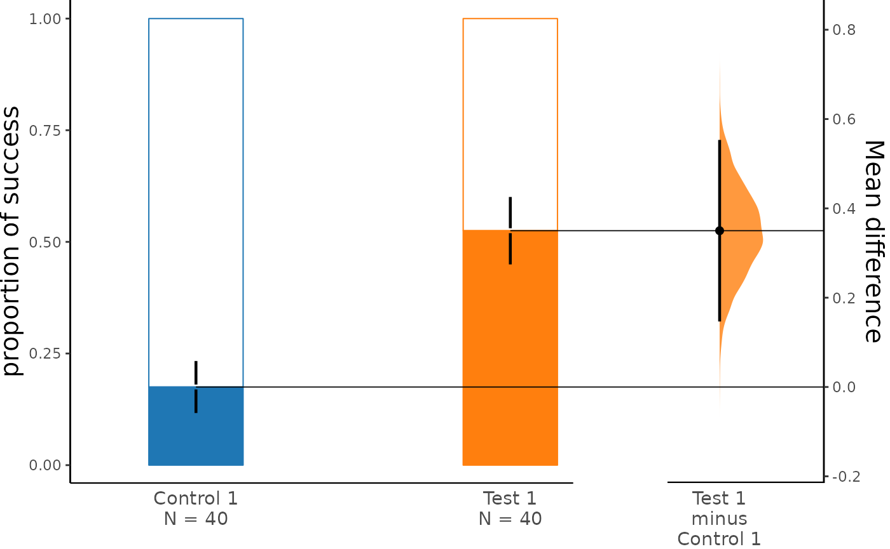

``` r

dabest_plot(two_groups_unpaired.cohens_h)
```

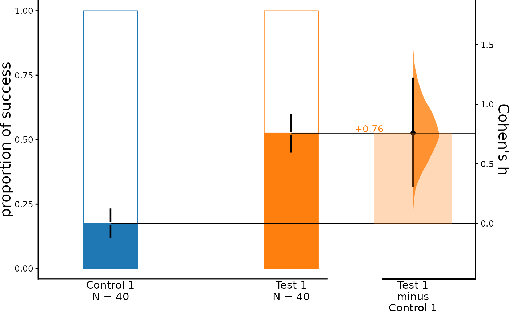

The white portion of the bar represents the proportion of observations
in the dataset that do not belong to the category, which is equivalent
to the proportion of 0 in the data. The colored portion, on the other
hand, represents the proportion of observations that belong to the
category, which is equivalent to the proportion of 1 in the data
(success). The error bars in the plot display the mean and ± standard
deviation of each group as gapped lines. The gap represents the mean,
while the vertical ends represent the standard deviation. By default,
the bootstrap effect sizes are plotted on the right axis.

Alternatively, you can produce a **Cumming estimation plot** instead of
a Gardner-Altman plot by setting `float_contrast = FALSE` in the
[`dabest_plot()`](https://acclab.github.io/dabestr/reference/dabest_plot.md)
function. This will plot the bootstrap effect sizes below the raw data.

``` r

dabest_plot(two_groups_unpaired.mean_diff, float_contrast = FALSE)
```

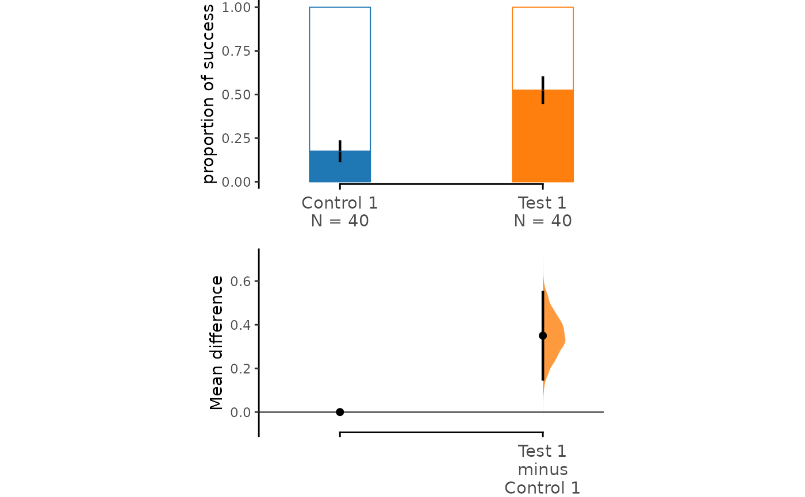

You can also modify the width of bars by setting the parameter
`raw_bar_width` in the
[`dabest_plot()`](https://acclab.github.io/dabestr/reference/dabest_plot.md)
function.

``` r

dabest_plot(two_groups_unpaired.mean_diff, raw_bar_width = 0.15)
```

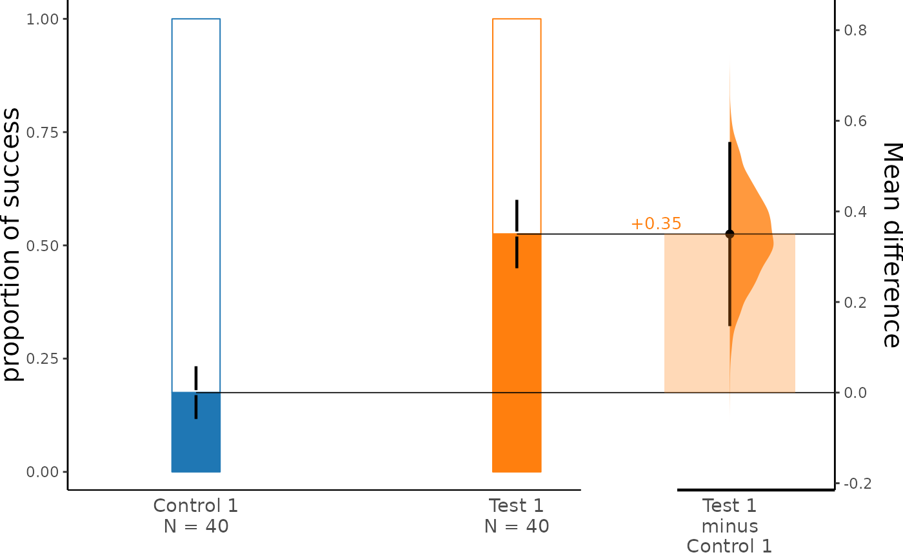

The parameters `swarm_label` and `contrast_label` can be used to set
labels for the y-axis of the bar plot and the contrast plot.

``` r

dabest_plot(two_groups_unpaired.mean_diff,
  swarm_label = "success", contrast_label = "difference"
)
```

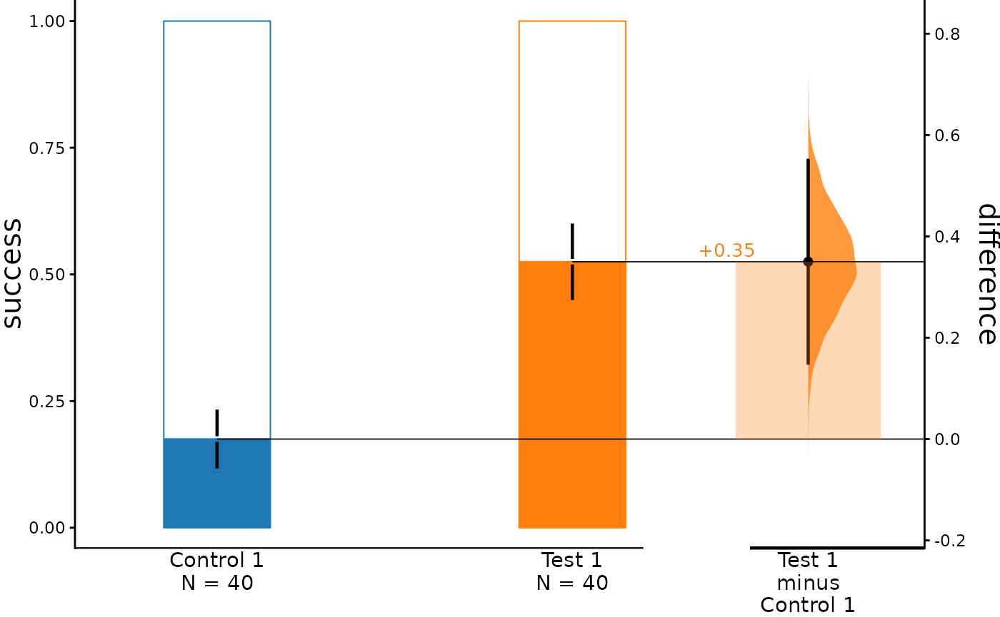

## Generating Sankey plots for paired proportions

For the paired version of the proportion plot, we adopt the style of a
Sankey Diagram. The width of each bar in each xtick represents the
proportion of the corresponding label in the group, and the strip
denotes the paired relationship for each observation.

Similar to the unpaired version, the
[`dabest_plot()`](https://acclab.github.io/dabestr/reference/dabest_plot.md)
function is used to produce a **Gardner-Altman estimation plot**, the
only difference is that the `paired` parameter is set to either
“baseline” or “sequential” when loading the data.

``` r

two_groups_baseline.mean_diff <- load(df,
  x = Group, y = Success,
  idx = c("Control 1", "Test 1"),
  proportional = TRUE,
  paired = "baseline", id_col = ID
) %>%
  mean_diff()

dabest_plot(two_groups_baseline.mean_diff)
```

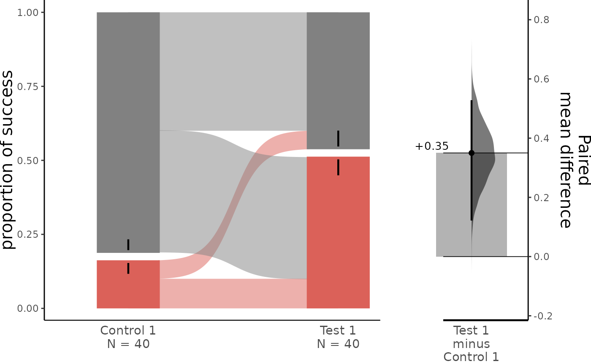

The paired proportional plot also supports the `float_contrast`
parameter, which can be set to `FALSE` to produce a **Cumming estimation
plot**.

``` r

dabest_plot(two_groups_baseline.mean_diff, float_contrast = FALSE)
```

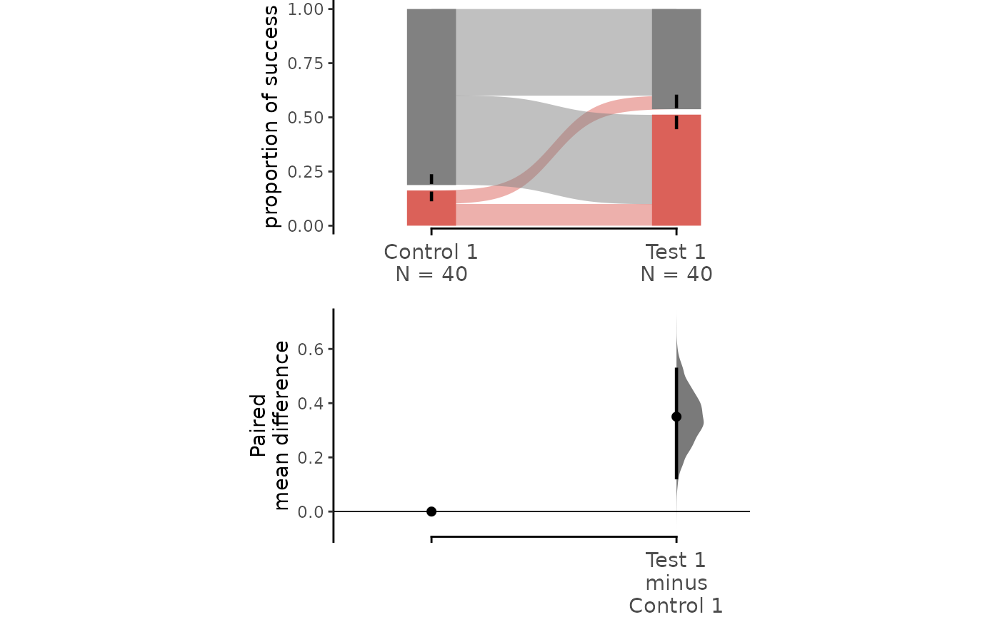

The upper part (grey section) of the bar represents the proportion of
observations in the dataset that do not belong to the category,
equivalent to the proportion of 0 in the data. The lower part,
conversely, represents the proportion of observations that belong to the
category, synonymous with **success**, equivalent to the proportion of 1
in the data.

Repeated measures are also supported in paired proportional plot. By
adjusting the `paired` parameter, two types of plot can be generated.

By default, the raw data plot (upper part) in both “baseline” and
“sequential” repeated measures remains the same; the only difference is
the lower part. For detailed information about repeated measures, please
refer to
[`vignette("tutorial_repeated_measures")`](https://acclab.github.io/dabestr/articles/tutorial_repeated_measures.md).

``` r

multi_group_baseline.mean_diff <- load(df,
  x = Group, y = Success,
  idx = list(
    c(
      "Control 1", "Test 1",
      "Test 2", "Test 3"
    ),
    c(
      "Test 4", "Test 5",
      "Test 6"
    )
  ),
  proportional = TRUE,
  paired = "baseline", id_col = ID
) %>%
  mean_diff()

dabest_plot(multi_group_baseline.mean_diff,
  swarm_y_text = 11, contrast_y_text = 11
)
```

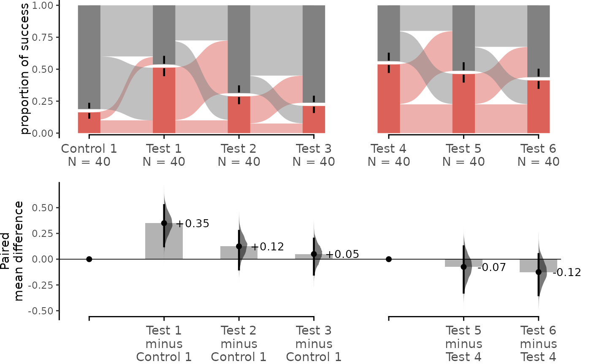

``` r

multi_group_sequential.mean_diff <- load(df,
  x = Group, y = Success,
  idx = list(
    c(
      "Control 1", "Test 1",
      "Test 2", "Test 3"
    ),
    c(
      "Test 4", "Test 5",
      "Test 6"
    )
  ),
  proportional = TRUE,
  paired = "sequential", id_col = ID
) %>%
  mean_diff()

dabest_plot(multi_group_sequential.mean_diff,
  swarm_y_text = 11, contrast_y_text = 11
)
```


If you want to specify the order of the groups, you can use the `idx`
parameter in the
[`load()`](https://acclab.github.io/dabestr/reference/load.md) function.

For all the groups to be compared together, you can put all the groups
in the `idx` parameter in the
[`load()`](https://acclab.github.io/dabestr/reference/load.md) function
in a singular vector/non-nested list.

``` r

multi_group_baseline_specify.mean_diff <- load(df,
  x = Group, y = Success,
  idx = c(
    "Control 1", "Test 1",
    "Test 2", "Test 3",
    "Test 4", "Test 5",
    "Test 6"
  ),
  proportional = TRUE,
  paired = "baseline", id_col = ID
) %>%
  mean_diff()

dabest_plot(multi_group_baseline_specify.mean_diff,
  swarm_y_text = 11, contrast_y_text = 11
)
```

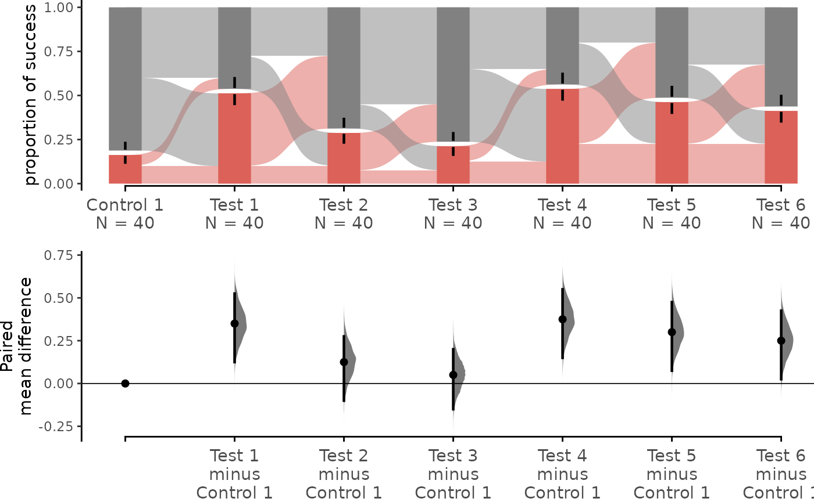

### Adjustment parameters

By adjusting the `sankey` and `flow` parameters, you can create
different types of paired proportional plots.

By default, the `sankey` and `flow` arguments are set to `TRUE` to
accommodate the needs of repeated-measures analyses. When `sankey` is
set to `FALSE`, the `dabestr` package generates a bar plot with a
similar aesthetic to the paired proportional plot. When `flow` is set to
`FALSE`, each group of comparison forms a sankey diagram which does not
connect to other groups of comparison.

``` r

separate_control.mean_diff <- load(df,
  x = Group, y = Success,
  idx = list(
    c("Control 1", "Test 1"),
    c("Test 2", "Test 3"),
    c("Test 4", "Test 5", "Test 6")
  ),
  proportional = TRUE,
  paired = "sequential", id_col = ID
) %>%
  mean_diff()

dabest_plot(separate_control.mean_diff, swarm_y_text = 11, contrast_y_text = 11)
```

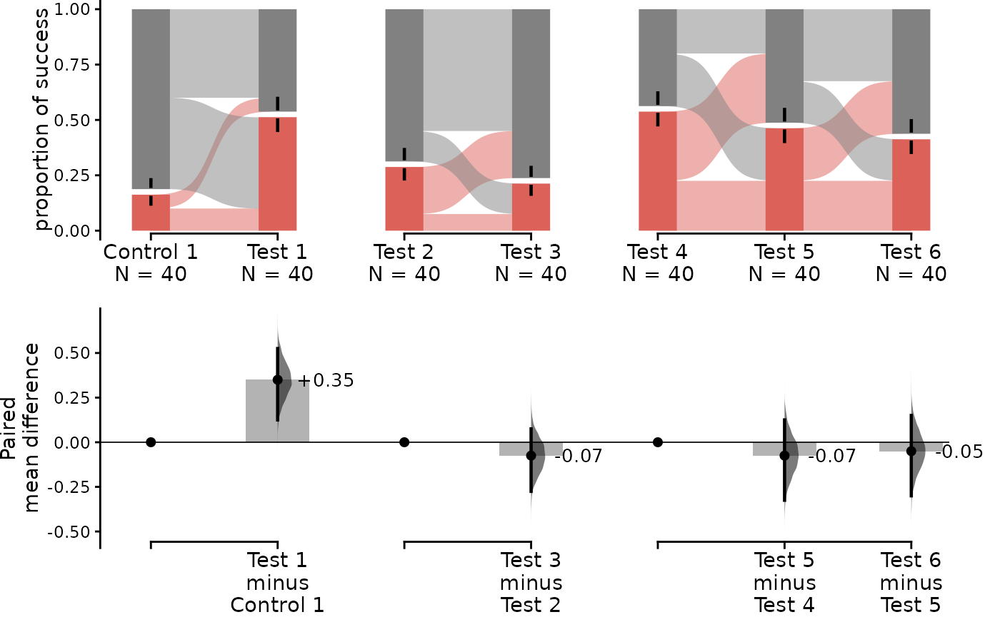

``` r

dabest_plot(separate_control.mean_diff,
  swarm_y_text = 11, contrast_y_text = 11,
  sankey = FALSE
)
```

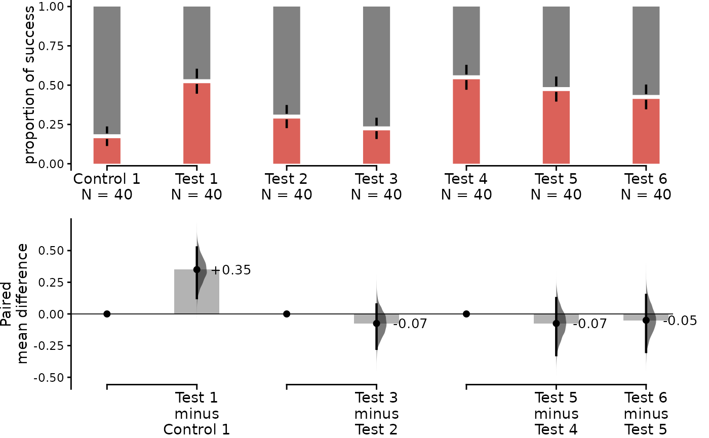

``` r

dabest_plot(separate_control.mean_diff,
  swarm_y_text = 11, contrast_y_text = 11,
  flow = FALSE
)
```

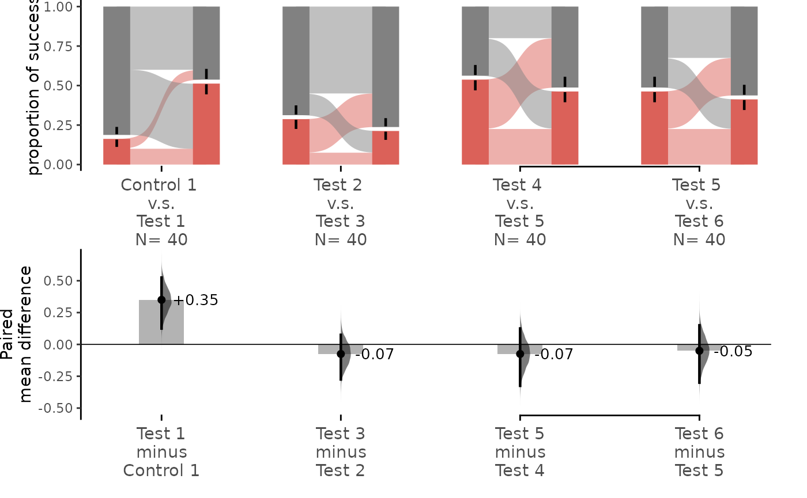
