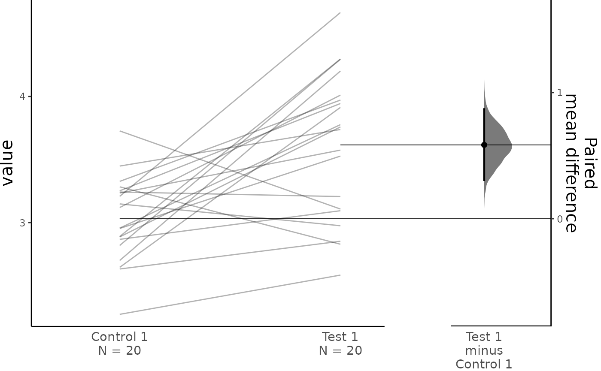
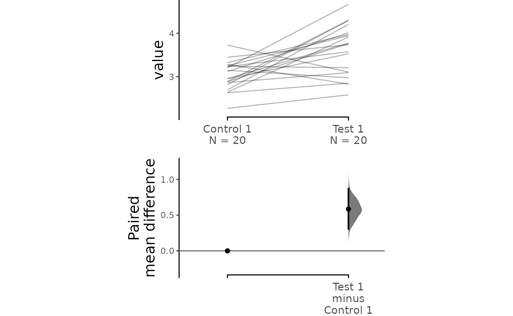
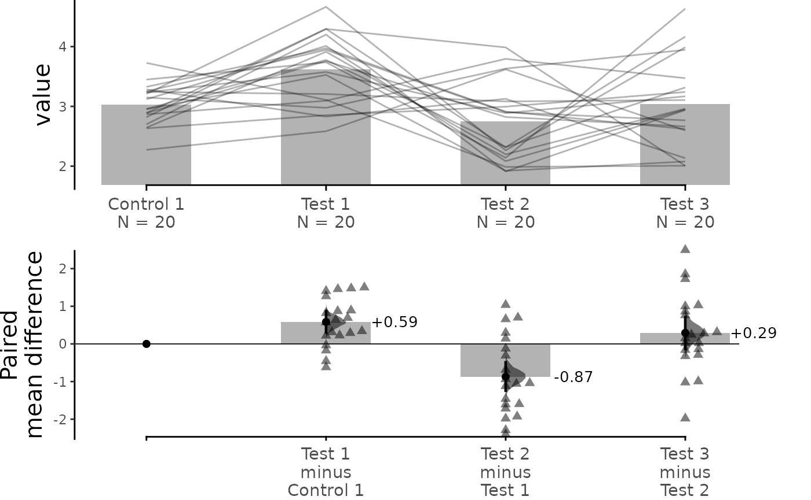
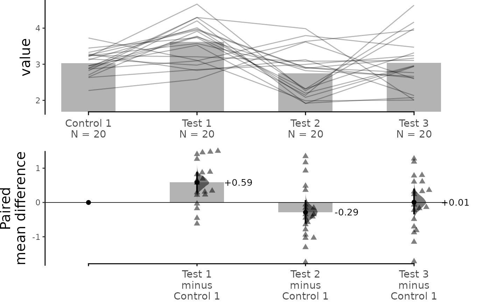
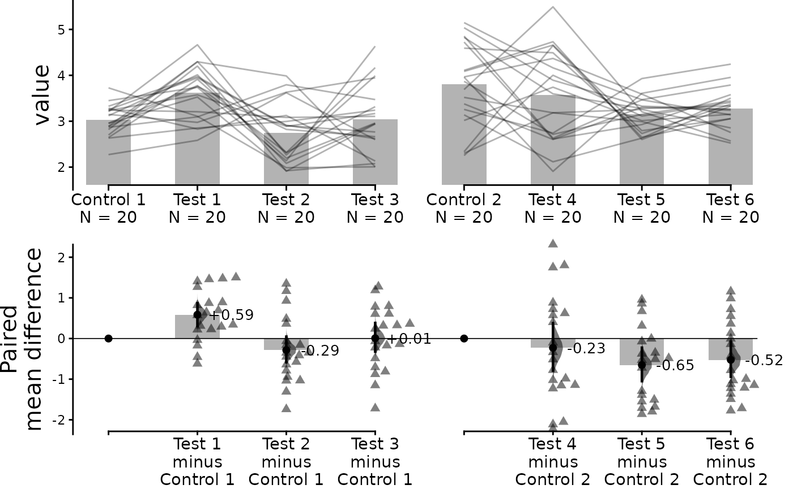
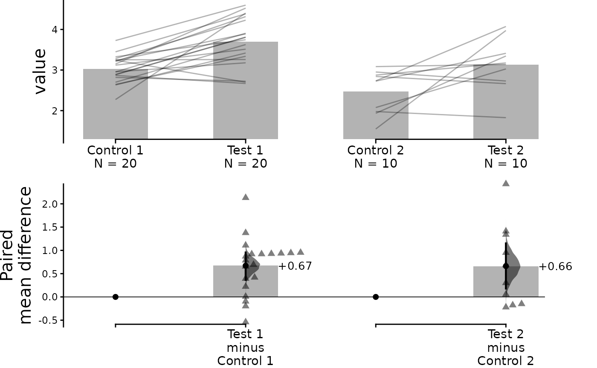

# Tutorial: Repeated Measures

This vignette documents how the `dabestr` package can generate
estimation plots for experiments with repeated-measures designs. With
`dabestr`, you can calculate and plot effect sizes for:

- Comparing each group to a shared control (control vs. group i;
  `baseline`)
- Comparing each measurement to the one directly preceding it (group i
  vs group i+1; `sequential`)

This is an improved version of `paired data plotting` in previous
versions, which only supported computations involving one test group and
one control group.

To use these features, simply declare the `paired` argument as either
“sequential” or “baseline” when running the
[`load()`](https://acclab.github.io/dabestr/reference/load.md) function.
Additionally, you must pass a column in the dataset that indicates the
identity of each observation using the `id_col` keyword.

``` r

library(dabestr)
library(dplyr)
```

## Create dataset for demo

``` r

set.seed(12345) # Fix the seed so the results are reproducible.
N <- 20 # The number of samples taken from each population

# Create samples
c1 <- rnorm(N, mean = 3, sd = 0.4)
c2 <- rnorm(N, mean = 3.5, sd = 0.75)
c3 <- rnorm(N, mean = 3.25, sd = 0.4)

t1 <- rnorm(N, mean = 3.5, sd = 0.5)
t2 <- rnorm(N, mean = 2.5, sd = 0.6)
t3 <- rnorm(N, mean = 3, sd = 0.75)
t4 <- rnorm(N, mean = 3.5, sd = 0.75)
t5 <- rnorm(N, mean = 3.25, sd = 0.4)
t6 <- rnorm(N, mean = 3.25, sd = 0.4)

# Add a `gender` column for coloring the data.
gender <- c(rep("Male", N / 2), rep("Female", N / 2))

# Add an `id` column for paired data plotting.
id <- 1:N

# Combine samples and gender into a DataFrame.
df <- tibble::tibble(
  `Control 1` = c1, `Control 2` = c2, `Control 3` = c3,
  `Test 1` = t1, `Test 2` = t2, `Test 3` = t3, `Test 4` = t4, `Test 5` = t5, `Test 6` = t6,
  Gender = gender, ID = id
)

df <- df %>%
  tidyr::gather(key = Group, value = Measurement, -ID, -Gender)
```

## Loading Data

``` r

two_groups_paired_sequential <- load(df,
  x = Group, y = Measurement,
  idx = c("Control 1", "Test 1"),
  paired = "sequential", id_col = ID
)

print(two_groups_paired_sequential)
#> DABESTR v2025.3.14
#> ==================
#> 
#> Good morning!
#> The current time is 07:07 AM on Wednesday July 29, 2026.
#> 
#> Paired effect size(s) for the sequential design of repeated-measures experiment \nwith 95% confidence intervals will be computed for:
#> 1. Test 1 minus Control 1
#> 
#> 5000 resamples will be used to generate the effect size bootstraps.
```

``` r

two_groups_paired_baseline <- load(df,
  x = Group, y = Measurement,
  idx = c("Control 1", "Test 1"),
  paired = "baseline", id_col = ID
)

print(two_groups_paired_baseline)
#> DABESTR v2025.3.14
#> ==================
#> 
#> Good morning!
#> The current time is 07:07 AM on Wednesday July 29, 2026.
#> 
#> Paired effect size(s) for repeated measures against baseline \nwith 95% confidence intervals will be computed for:
#> 1. Test 1 minus Control 1
#> 
#> 5000 resamples will be used to generate the effect size bootstraps.
```

When only 2 paired data groups are involved, assigning either “baseline”
or “sequential” to `paired` will give you the same numerical results.

``` r

two_groups_paired_sequential.mean_diff <- mean_diff(two_groups_paired_sequential)
two_groups_paired_baseline.mean_diff <- mean_diff(two_groups_paired_baseline)
```

``` r

print(two_groups_paired_sequential.mean_diff)
#> DABESTR v2025.3.14
#> ==================
#> 
#> Good morning!
#> The current time is 07:07 AM on Wednesday July 29, 2026.
#> 
#> The paired mean difference between Test 1 and Control 1 is 0.585 [95%CI 0.307, 0.869].
#> The p-value of the two-sided permutation t-test is 0.0028, calculated for legacy purposes only.
#> 
#> 5000 bootstrap samples were taken; the confidence interval is bias-corrected and accelerated.
#> Any p-value reported is the probability of observing the effect size (or greater),
#> assuming the null hypothesis of zero difference is true.
#> For each p-value, 5000 reshuffles of the control and test labels were performed.
```

``` r

print(two_groups_paired_baseline.mean_diff)
#> DABESTR v2025.3.14
#> ==================
#> 
#> Good morning!
#> The current time is 07:07 AM on Wednesday July 29, 2026.
#> 
#> The paired mean difference between Test 1 and Control 1 is 0.585 [95%CI 0.307, 0.869].
#> The p-value of the two-sided permutation t-test is 0.0028, calculated for legacy purposes only.
#> 
#> 5000 bootstrap samples were taken; the confidence interval is bias-corrected and accelerated.
#> Any p-value reported is the probability of observing the effect size (or greater),
#> assuming the null hypothesis of zero difference is true.
#> For each p-value, 5000 reshuffles of the control and test labels were performed.
```

For paired data, we use
[slopegraphs](http://www.edwardtufte.com/notes-sketches/?msg_id=0003nk%3E)
(another innovation from Edward Tufte) to connect paired observations.
Both Gardner-Altman and Cumming plots support this.

``` r

dabest_plot(two_groups_paired_sequential.mean_diff,
  raw_marker_size = 0.5, raw_marker_alpha = 0.3
)
```



``` r

dabest_plot(two_groups_paired_sequential.mean_diff,
  float_contrast = FALSE,
  raw_marker_size = 0.5, raw_marker_alpha = 0.3,
  contrast_ylim = c(-0.3, 1.3)
)
```



``` r

dabest_plot(two_groups_paired_baseline.mean_diff,
  raw_marker_size = 0.5, raw_marker_alpha = 0.3
)
```


``` r

dabest_plot(two_groups_paired_baseline.mean_diff,
  float_contrast = FALSE,
  raw_marker_size = 0.5, raw_marker_alpha = 0.3,
  contrast_ylim = c(-0.3, 1.3)
)
```


You can also create repeated-measures plots with multiple test groups.
In this case, declaring `paired` to be “sequential” or “baseline” will
generate the same slopegraph, reflecting the repeated-measures
experimental design, but different contrast plots, to show the
“sequential” or “baseline” comparison:

``` r

sequential_repeated_measures.mean_diff <- load(df,
  x = Group, y = Measurement,
  idx = c(
    "Control 1", "Test 1",
    "Test 2", "Test 3"
  ),
  paired = "sequential", id_col = ID
) %>%
  mean_diff()

print(sequential_repeated_measures.mean_diff)
#> DABESTR v2025.3.14
#> ==================
#> 
#> Good morning!
#> The current time is 07:07 AM on Wednesday July 29, 2026.
#> 
#> The paired mean difference between Test 1 and Control 1 is 0.585 [95%CI 0.307, 0.869].
#> The p-value of the two-sided permutation t-test is 0.0028, calculated for legacy purposes only.
#> 
#> The paired mean difference between Test 2 and Test 1 is -0.871 [95%CI -1.244, -0.489].
#> The p-value of the two-sided permutation t-test is 0.0004, calculated for legacy purposes only.
#> 
#> The paired mean difference between Test 3 and Test 2 is 0.293 [95%CI -0.136, 0.713].
#> The p-value of the two-sided permutation t-test is 0.2184, calculated for legacy purposes only.
#> 
#> 5000 bootstrap samples were taken; the confidence interval is bias-corrected and accelerated.
#> Any p-value reported is the probability of observing the effect size (or greater),
#> assuming the null hypothesis of zero difference is true.
#> For each p-value, 5000 reshuffles of the control and test labels were performed.
```

``` r

dabest_plot(sequential_repeated_measures.mean_diff,
  raw_marker_size = 0.5, raw_marker_alpha = 0.3
)
```



``` r

baseline_repeated_measures.mean_diff <- load(df,
  x = Group, y = Measurement,
  idx = c(
    "Control 1", "Test 1",
    "Test 2", "Test 3"
  ),
  paired = "baseline", id_col = ID
) %>%
  mean_diff()

print(baseline_repeated_measures.mean_diff)
#> DABESTR v2025.3.14
#> ==================
#> 
#> Good morning!
#> The current time is 07:07 AM on Wednesday July 29, 2026.
#> 
#> The paired mean difference between Test 1 and Control 1 is 0.585 [95%CI 0.307, 0.869].
#> The p-value of the two-sided permutation t-test is 0.0028, calculated for legacy purposes only.
#> 
#> The paired mean difference between Test 2 and Control 1 is -0.286 [95%CI -0.585, 0.046].
#> The p-value of the two-sided permutation t-test is 0.1017, calculated for legacy purposes only.
#> 
#> The paired mean difference between Test 3 and Control 1 is 0.007 [95%CI -0.323, 0.383].
#> The p-value of the two-sided permutation t-test is 0.7353, calculated for legacy purposes only.
#> 
#> 5000 bootstrap samples were taken; the confidence interval is bias-corrected and accelerated.
#> Any p-value reported is the probability of observing the effect size (or greater),
#> assuming the null hypothesis of zero difference is true.
#> For each p-value, 5000 reshuffles of the control and test labels were performed.
```

``` r

dabest_plot(baseline_repeated_measures.mean_diff,
  raw_marker_size = 0.5, raw_marker_alpha = 0.3
)
```



Just as with unpaired data, the `dabestr` package enables you to perform
complex visualizations and statistics for paired data.

``` r

multi_baseline_repeated_measures.mean_diff <- load(df,
  x = Group, y = Measurement,
  idx = list(
    c(
      "Control 1", "Test 1",
      "Test 2", "Test 3"
    ),
    c(
      "Control 2", "Test 4",
      "Test 5", "Test 6"
    )
  ),
  paired = "baseline", id_col = ID
) %>%
  mean_diff()

dabest_plot(multi_baseline_repeated_measures.mean_diff,
  raw_marker_size = 0.5, raw_marker_alpha = 0.3
)
```



## Paired groups with different sample sizes across comparisons

Repeated-measures plots also work when different comparison pairs have
different sample sizes, as long as each pair is internally balanced.

``` r

set.seed(12345)
N1 <- 20
N2 <- 10

df_unequal_pairs <- tibble::tibble(
  Group = rep(c("Control 1", "Test 1", "Control 2", "Test 2"), c(N1, N1, N2, N2)),
  Measurement = c(
    rnorm(N1, mean = 3, sd = 0.4),   # Control 1
    rnorm(N1, mean = 3.5, sd = 0.5), # Test 1
    rnorm(N2, mean = 2.5, sd = 0.4), # Control 2
    rnorm(N2, mean = 3.0, sd = 0.5)  # Test 2
  ),
  ID = c(1:N1, 1:N1, 1:N2, 1:N2)
)
```

``` r

# Each pair is internally balanced even though the two pairs differ in size.
multi_unequal_pairs.mean_diff <- load(df_unequal_pairs,
  x = Group, y = Measurement,
  idx = list(c("Control 1", "Test 1"), c("Control 2", "Test 2")),
  paired = "sequential", id_col = ID
) %>%
  mean_diff()

dabest_plot(multi_unequal_pairs.mean_diff,
  raw_marker_size = 0.5, raw_marker_alpha = 0.3
)
```



An unbalanced pair (different n *within* a pair) is still caught as an
error:

``` r

# Remove one row from Test 1 so Control 1 (n=20) and Test 1 (n=19) are mismatched within the pair.
df_bad_pair <- df_unequal_pairs %>%
  dplyr::filter(!(Group == "Test 1" & ID == 1))

load(df_bad_pair,
  x = Group, y = Measurement,
  idx = list(c("Control 1", "Test 1"), c("Control 2", "Test 2")),
  paired = "sequential", id_col = ID
)
#> Error in `load()`:
#> ! data is paired, as indicated by paired but size of control and
#>   treatment groups are not equal.
#> ✖ Ensure that the size of control and treatment groups are the same for paired
#>   comparisons.
```
